# MrGreenPest — คู่มือธุรกิจฉบับสมบูรณ์

> **สำหรับใคร?** เอกสารนี้เขียนให้ **Business Analyst, Developer, พนักงานใหม่** ที่ไม่เคยรู้จักธุรกิจกำจัดปลวก/แมลงมาก่อน อ่านจบแล้วจะเข้าใจกระบวนการทั้งหมดของบริษัท เห็นภาพว่าใครทำอะไร เมื่อไหร่ และระบบบันทึกอะไรบ้าง
>
> **วิธีอ่าน:** อ่านตามลำดับจากบทนำ → บทบาท → กระบวนการ
> ภาพ Mermaid จะ render เป็นรูปภาพในตัวดูที่รองรับ (GitHub, VS Code + extension, Notion, Obsidian)

---

## สารบัญ

- [บทที่ 0 — คำศัพท์ที่ต้องรู้ก่อน](#บทที่-0--คำศัพท์ที่ต้องรู้ก่อน)
- [บทที่ 1 — ภาพรวมธุรกิจ](#บทที่-1--ภาพรวมธุรกิจ)
- [บทที่ 2 — บทบาทในองค์กร](#บทที่-2--บทบาทในองค์กร)
- [บทที่ 3 — ข้อมูลลูกค้า (Customer Master)](#บทที่-3--ข้อมูลลูกค้า-customer-master)
- [บทที่ 4 — กระบวนการขาย ช่วงที่ 1: สำรวจหน้างาน → ใบประเมิน](#บทที่-4--กระบวนการขาย-ช่วงที่-1-สำรวจหน้างาน--ใบประเมิน)
- [บทที่ 5 — กระบวนการขาย ช่วงที่ 2: ใบเสนอราคา](#บทที่-5--กระบวนการขาย-ช่วงที่-2-ใบเสนอราคา)
- [บทที่ 6 — กระบวนการขาย ช่วงที่ 3: เซ็นสัญญา](#บทที่-6--กระบวนการขาย-ช่วงที่-3-เซ็นสัญญา)
- [บทที่ 7 — กระบวนการบริการ: มอบหมายงาน → ทำงาน → ปิดงาน](#บทที่-7--กระบวนการบริการ-มอบหมายงาน--ทำงาน--ปิดงาน)
- [บทที่ 8 — รายงานบริการและการเก็บเงินหน้างาน](#บทที่-8--รายงานบริการและการเก็บเงินหน้างาน)
- [บทที่ 9 — ปิดงานรายวัน (Daily Closure)](#บทที่-9--ปิดงานรายวัน-daily-closure)
- [บทที่ 10 — ใบแจ้งหนี้และการชำระเงิน](#บทที่-10--ใบแจ้งหนี้และการชำระเงิน)
- [บทที่ 11 — ใบเสร็จและบัญชีบริษัท](#บทที่-11--ใบเสร็จและบัญชีบริษัท)
- [บทที่ 12 — การเบิกเงินภายในบริษัท](#บทที่-12--การเบิกเงินภายในบริษัท)
- [บทที่ 13 — สินค้าคงคลังและคลังสินค้า](#บทที่-13--สินค้าคงคลังและคลังสินค้า)
- [บทที่ 14 — การติดตามและต่อสัญญา](#บทที่-14--การติดตามและต่อสัญญา)
- [บทที่ 15 — ระบบแจ้งเตือน](#บทที่-15--ระบบแจ้งเตือน)
- [บทที่ 16 — ช่องทางลูกค้า (Customer Portal + LINE)](#บทที่-16--ช่องทางลูกค้า-customer-portal--line)
- [บทที่ 17 — รายงานเชิงบริหาร](#บทที่-17--รายงานเชิงบริหาร)
- [บทที่ 18 — สถานะเอกสารทั้งหมด](#บทที่-18--สถานะเอกสารทั้งหมด)

---

## บทที่ 0 — คำศัพท์ที่ต้องรู้ก่อน

ก่อนเริ่ม คุณต้องเข้าใจคำศัพท์เหล่านี้ เพราะจะปรากฏซ้ำตลอดเอกสาร

| คำศัพท์ | ความหมาย |
|---|---|
| **ใบประเมิน (Assessment)** | เอกสารที่ช่าง (LEAD_TECH/TECH) กรอกหลังออกสำรวจหน้างาน บันทึกว่าลูกค้ามีปัญหาศัตรูพืชชนิดใด พื้นที่เท่าไหร่ ราคาเท่าไหร่ |
| **ใบเสนอราคา (Quotation)** | เอกสารที่ส่งให้ลูกค้า เพื่อให้ลูกค้าตัดสินใจซื้อบริการ |
| **สัญญา (Contract)** | เกิดเมื่อลูกค้าเซ็นใบเสนอราคา ระบบจะสร้างสัญญาให้อัตโนมัติ |
| **ตารางการเข้าบริการ (Service Schedule)** | กำหนดการที่ระบุว่าจะเข้าบริการลูกค้าครั้งใดบ้าง เช่น 4 ครั้ง/ปี ทุก 3 เดือน |
| **งานภาคสนาม (Job)** | งานแต่ละครั้งที่ช่างต้องเข้าไปทำที่หน้างานลูกค้า |
| **รายงานบริการ (Service Report)** | บันทึกผลการทำงานหน้างาน บันทึกเวลาเข้า-ออก สารเคมีที่ใช้ ลายเซ็นลูกค้า |
| **ใบแจ้งหนี้ (Invoice)** | เอกสารเรียกเก็บเงินตามงวดในสัญญา |
| **ใบเสร็จ/ใบกำกับภาษี (Receipt)** | ออกหลังลูกค้าชำระและบัญชีตรวจสอบแล้ว |
| **ใบขอเบิกเงิน (Cash Withdrawal Request)** | ใบที่พนักงานใช้เบิกเงินจากบริษัท เช่น ค่าน้ำมัน |
| **ใบเบิกสินค้า (Issue Note)** | ใบที่ใช้เบิกสินค้าจากคลังหลักไปคลังย่อย/รถ |
| **ปิดงานรายวัน (Daily Closure)** | สรุปงานทั้งหมดของวันนั้น เช็คเงินที่เก็บได้ ค่าใช้จ่าย เลขไมล์รถ |
| **งานขาย** | ในระบบไม่มี role "เซลส์" แยก — **LEAD_TECH** (หัวหน้าทีมช่าง) และ **TECH** (ช่างภาคสนาม) ทำหน้าที่ขายควบคู่กับงานบริการ (ไปสำรวจ, ทำใบประเมิน, ใบเสนอราคา, ติดตามลูกค้า, ต่อสัญญา) |
| **ช่าง / ช่างเทคนิค (Technician)** | ผู้ไปทำงานหน้างาน ฉีดยา วางเหยื่อ ติดตั้งสถานี |
| **หัวหน้าทีม (Lead Tech)** | หัวหน้าช่าง ดูแลทีมช่าง 3-5 คน มอบหมายงาน ตรวจสอบงานเสร็จ |
| **แอดมิน (Admin)** | พนักงานสำนักงาน ออกเอกสาร ตรวจสอบการรับเงิน |
| **CFO** | ผู้บริหารฝ่ายการเงิน อนุมัติเรื่องเงินทั้งหมด |
| **COO / CEO** | ผู้บริหารระดับสูง รับแจ้งเตือนเรื่องสำคัญ |
| **คลังหลัก** | คลังสินค้าที่สำนักงาน เก็บสารเคมีและอุปกรณ์ทั้งหมด |
| **คลังย่อย / รถบริการ** | รถที่ช่างใช้ ในรถมีสารเคมีที่เบิกมาจากคลังหลัก |
| **VAT** | ภาษีมูลค่าเพิ่ม 7% ที่บวกในใบเสนอราคา/ใบแจ้งหนี้ |
| **งวด (Installment)** | การแบ่งจ่ายเงินสัญญาเป็นหลายครั้ง เช่น 4 งวด งวดละ 25% |

---

## บทที่ 1 — ภาพรวมธุรกิจ

### 1.1 บริษัททำอะไร?

MrGreenPest เป็นบริษัทรับจ้าง**กำจัดศัตรูพืช**ในบ้านและสถานประกอบการ ครอบคลุม:
- **ปลวก (Termite)** — กำจัดด้วยสารเคมีอัดดิน, สถานีเหยื่อใต้ดิน, สเปรย์
- **มด/แมลงสาบ (Ant/Cockroach)** — เจล, ผง, ฉีดพ่น
- **หนูและสัตว์ฟัน (Rodent)** — กับดัก, อาหารพิษ, อุดรู
- **ยุง (Mosquito)** — ฟอกควัน, ฉีดสเปรย์
- **อื่นๆ** — แมลงต่างๆ ตามที่ลูกค้าร้องขอ

### 1.2 รายได้มาจากไหน?

ลูกค้า **เซ็นสัญญารายปี** กับบริษัท ในสัญญาระบุว่าจะเข้าบริการกี่ครั้งต่อปี (เช่น 4, 7, 12 ครั้ง) และค่าบริการรวมเท่าไหร่ ลูกค้าจ่ายเงินตามงวดที่ตกลง

**ตัวอย่างจริง:**
- ลูกค้า A เซ็นสัญญา 36,000 บาท/ปี เข้าบริการ 4 ครั้ง (ทุก 3 เดือน) แบ่งจ่าย 4 งวด งวดละ 9,000 บาท
- ลูกค้า B เซ็นสัญญา 84,000 บาท/ปี เข้าบริการ 12 ครั้ง (ทุกเดือน) จ่ายครั้งเดียวต้นปี

### 1.3 วงจรลูกค้าตั้งแต่ต้นจนจบ

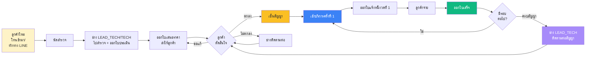

### 1.4 เอกสารหลักทั้งหมด + ลำดับการเกิด

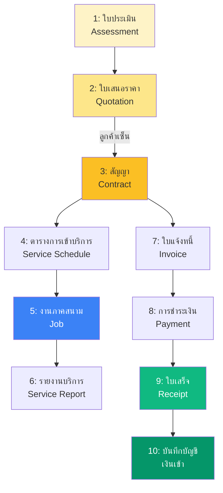

**สิ่งสำคัญที่ต้องเข้าใจ:**
1. เอกสารหลังจะ**สืบทอดข้อมูล**จากเอกสารก่อนหน้า — ไม่ต้องกรอกซ้ำ
2. แต่ละเอกสารมี**สถานะ** (Status) ที่เปลี่ยนตามลำดับ
3. การเปลี่ยนสถานะสำคัญต้องการ**การอนุมัติ**

---

## บทที่ 2 — บทบาทในองค์กร

### 2.1 ผังองค์กรและการรายงาน

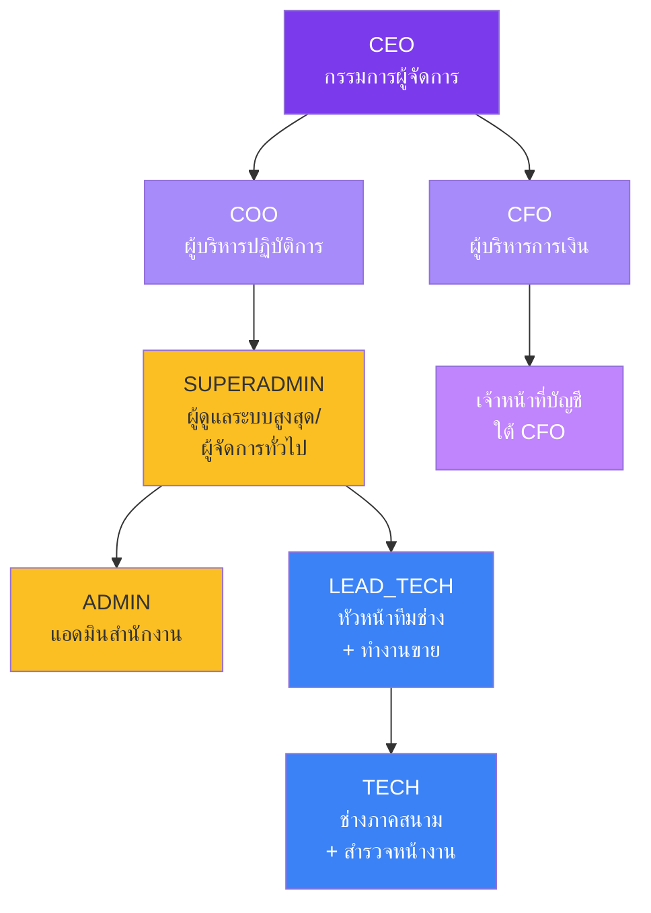

> **หมายเหตุสำคัญ:** ระบบนี้**ไม่มี role "เซลส์" แยกต่างหาก** — งานขาย (สำรวจ, ใบประเมิน, ใบเสนอราคา, ติดตามลูกค้า, ต่อสัญญา) ทำโดย **LEAD_TECH** และ **TECH** ควบคู่กับงานบริการหน้างาน

### 2.2 ภาพรวมจำนวนคนและสัดส่วน

| ระดับ | บทบาท | ปกติมีกี่คน | สัดส่วน |
|---|---|---|---|
| Executive | CEO | 1 | กรรมการ |
| Executive | COO | 1 | ผู้บริหาร |
| Executive | CFO | 1 | ผู้บริหาร |
| Operations | SUPERADMIN | 1-2 | ผู้จัดการ |
| Office | ADMIN | 2-5 | แอดมิน |
| Field | LEAD_TECH | 3-8 | หัวหน้าทีม + ทำงานขาย |
| Field | TECH | 10-30 | ช่าง + สำรวจหน้างาน |

> **หมายเหตุ:** ตำแหน่งเดียวอาจมีหลายคน เช่น ADMIN 3 คน แบ่งกันดูแลงาน

---

### 2.3 CEO (Chief Executive Officer)

#### ภาพรวม
CEO คือ**กรรมการผู้จัดการ**ของบริษัท เป็นเจ้าของหรือผู้บริหารสูงสุด ตัดสินใจเชิงกลยุทธ์ ทิศทางบริษัท การลงทุน การจ้างพนักงานระดับสูง

#### คุณสมบัติ
- ประสบการณ์บริหารธุรกิจ 10+ ปี
- เข้าใจอุตสาหกรรมกำจัดศัตรูพืช
- มีความสามารถวิเคราะห์การเงิน อ่าน P&L ได้
- ตัดสินใจรวดเร็ว

#### หน้าที่หลัก
1. **กำหนดทิศทางและกลยุทธ์บริษัท**
   - เป้าหมายรายได้ประจำปี (เช่น "เพิ่ม 20% จากปีก่อน")
   - เป้าหมายการขยาย (เปิดสาขาใหม่, เพิ่มประเภทบริการ)
   - การลงทุนใหญ่ (ซื้อรถใหม่, ระบบใหม่)
2. **อนุมัติกรณีพิเศษระดับสูง**
   - ดีลใหญ่ที่ราคาต่ำกว่ามาตรฐานมาก
   - กรณีที่ COO/CFO ส่งต่อขึ้นมา
3. **ติดตามภาพรวมธุรกิจ**
   - ดู Dashboard รายสัปดาห์
   - ดู P&L รายเดือน
   - ติดตามตัวเลข KPI หลัก

#### งานประจำวัน (Daily Routine)
```
08:30 — เปิดระบบ ดู Dashboard ภาพรวมเมื่อวาน
        (รายได้ที่บันทึก, Job ที่เสร็จ, ลูกหนี้)
09:00 — Stand-up meeting กับ COO/CFO 15 นาที
        คุย: ปัญหาที่ติด, ดีลใหญ่, การตัดสินใจวันนี้
10:00 — ประชุมกับ LEAD_TECH (ถ้ามีดีลใหญ่)
        หรือ พบลูกค้าสำคัญ
12:00 — พักเที่ยง / Networking
13:00 — งานเชิงกลยุทธ์ (อ่านรายงาน, วางแผน, อนุมัติเอกสาร)
16:00 — Review งานวันนี้กับทีม
17:30 — ดู Pipeline ของวันพรุ่งนี้
```

#### งานประจำสัปดาห์
- **จันทร์:** ประชุม Weekly Review (P&L สัปดาห์ที่ผ่านมา)
- **พฤหัสฯ:** ประชุม Strategy (ทิศทางสัปดาห์ถัดไป)
- **ตลอดสัปดาห์:** อนุมัติดีลใหญ่ๆ ที่ส่งขึ้นมา

#### งานประจำเดือน
- ดู P&L รายเดือน + เปรียบกับเป้า
- ประชุม Board (ถ้ามีคณะกรรมการ)
- ทบทวน KPI ของแต่ละทีม

#### อำนาจตัดสินใจ
- ✅ ตัดสินใจการลงทุนใหญ่ (>500,000 บาท)
- ✅ จ้าง/เลิกจ้างพนักงานระดับสูง
- ✅ อนุมัติแผนกลยุทธ์ประจำปี
- ✅ อนุมัติดีลพิเศษที่ราคาต่ำมาก (เกินที่ COO อนุมัติได้)

#### การอนุมัติในระบบ
| รายการ | ทำได้ไหม |
|---|---|
| ใบประเมินราคาต่ำ | ✅ (ระดับสูงสุด) |
| ใบเสนอราคาราคาต่ำ | ✅ (ระดับสูงสุด) |
| ดูทุก Report | ✅ |
| ดู Dashboard ภาพรวม | ✅ |

#### หน้าจอที่ใช้บ่อย
- **Dashboard** — ดูภาพรวมรายวัน/รายสัปดาห์/รายเดือน
- **Reports → กำไร-ขาดทุน** — ดู P&L
- **Reports → Sales Pipeline** — ดูสถานการณ์การขาย
- **Notifications** — รับแจ้งเตือนเรื่องสำคัญ

#### KPI / ตัวชี้วัด
- รายได้รวมรายเดือน vs เป้า
- กำไรสุทธิรายเดือน vs เป้า
- จำนวนลูกค้าใหม่ต่อเดือน
- อัตราการต่อสัญญา (Renewal Rate)
- ลูกหนี้ค้างชำระ (AR Aging)

#### ข้อห้าม / สิ่งที่ไม่ทำเอง
- ❌ ไม่ออกใบเสนอราคา/สัญญาเอง
- ❌ ไม่ทำงานหน้างาน
- ❌ ไม่อนุมัติใบเสร็จ (CFO ทำ)
- ❌ ไม่จัดการ Master Data (Admin ทำ)

#### ความสัมพันธ์กับ Role อื่น
- **กับ COO:** Daily check-in เรื่องปฏิบัติการ
- **กับ CFO:** Weekly review เรื่องการเงิน
- **กับ SUPERADMIN:** Monthly review เรื่องผลงาน

#### ตัวอย่างสถานการณ์จริง
**กรณีที่ 1:** LEAD_TECH เสนอราคาให้ลูกค้ารายใหญ่ (เครือโรงงาน) 1,000,000 บาท แต่ลูกค้าขอลด 30% → ราคาต่ำกว่ามาตรฐานมาก
→ ส่งถึง CEO โดยตรง (ผ่าน COO)
→ CEO ตัดสินใจ: "อนุมัติ เพราะเป็นการเปิดตลาดใหญ่"
→ ระบบบันทึกการอนุมัติ + เหตุผล

**กรณีที่ 2:** เดือนนี้กำไรต่ำกว่าเป้า 15%
→ CEO เรียกประชุม COO + CFO + SUPERADMIN
→ ตัดสินใจปรับกลยุทธ์: ลด discount นโยบาย, เพิ่ม LEAD_TECH/TECH อีก 2 ทีม

---

### 2.4 COO (Chief Operating Officer)

#### ภาพรวม
COO คือ**ผู้บริหารฝ่ายปฏิบัติการ** ดูแลงานประจำวันให้ราบรื่น โดยเฉพาะงานภาคสนาม การจัดการทีม การให้บริการ คุณภาพงาน

#### คุณสมบัติ
- ประสบการณ์ในธุรกิจกำจัดศัตรูพืช 5+ ปี
- รู้จักสารเคมี วิธีการกำจัดศัตรูพืชอย่างละเอียด
- บริหารทีมงานเก่ง
- แก้ปัญหาเฉพาะหน้าได้ดี

#### หน้าที่หลัก
1. **ดูแลงานภาคสนามทั้งหมด**
   - ตรวจสอบ Job ที่กำลังดำเนินการ
   - ติดตามปัญหาหน้างานที่ช่างรายงาน
   - แก้ไขกรณี emergency (เช่น ลูกค้าเปลี่ยนใจ, รถเสีย)
2. **บริหารทีมช่าง**
   - ประเมินผลงานหัวหน้าทีมและช่าง
   - จัดอบรมเทคนิคใหม่ๆ
   - ตัดสินใจรับช่างใหม่/เลิกจ้าง
3. **คุณภาพการบริการ**
   - ตรวจ Service Report ที่ลูกค้า rating ต่ำ
   - หาทางปรับปรุงกระบวนการ
4. **อนุมัติเอกสารระดับกลาง**
   - ใบประเมินราคาต่ำ (รายเล็ก-กลาง)
   - ใบเสนอราคาราคาต่ำ
5. **จัดการสารเคมีและอุปกรณ์**
   - ตัดสินใจซื้อสารเคมีใหม่
   - กำหนดลิมิตในรถบริการ

#### งานประจำวัน
```
07:30 — เปิดระบบ ดู Job วันนี้ที่จะออกงาน
        (กี่ Job, ทีมไหน, ลูกค้ารายใหญ่/พิเศษ?)
08:00 — Briefing กับ LEAD_TECH ทุกทีม 15 นาที
        (ทบทวน Job, แจ้งปัญหาที่ต้องระวัง)
09:00 — ตรวจอนุมัติเอกสารที่ค้าง
        (ใบประเมินราคาต่ำ, ใบเสนอราคา)
10:00 — สุ่มลงพื้นที่ตรวจ Job (1-2 ที่/สัปดาห์)
        หรือ แก้ปัญหาเร่งด่วน
12:00 — พักเที่ยง / Networking ลูกค้ารายใหญ่
13:30 — ประชุมกับ LEAD_TECH (รายดีลที่ติด)
15:00 — ดู Service Report ที่จบไปเมื่อวาน
        เช็ค rating ลูกค้า, ดูปัญหาที่ทำซ้ำ
16:30 — เคลียร์งานวันนี้ — Notification ที่ค้าง
17:30 — Wrap-up กับ CEO (ถ้ามีเรื่องสำคัญ)
```

#### งานประจำสัปดาห์
- **จันทร์:** ประชุมทีม LEAD_TECH ทั้งหมด (1 ชั่วโมง)
- **พุธ:** ตรวจคุณภาพงานช่าง (สุ่มดู service report)
- **ศุกร์:** Review งานสัปดาห์ + วางแผนสัปดาห์หน้า

#### อำนาจตัดสินใจ
- ✅ อนุมัติใบประเมิน/ใบเสนอราคาราคาต่ำระดับปกติ
- ✅ ตัดสินใจเรื่องคุณภาพงาน
- ✅ จ้าง/ปลด LEAD_TECH / TECH (ปรึกษา CEO ก่อนสำหรับ LEAD)
- ✅ ปรับลิมิตสินค้าในรถ
- ❌ ไม่อนุมัติเรื่องการเงิน (CFO)
- ❌ ไม่จัดการระบบ (SUPERADMIN)

#### การอนุมัติในระบบ
| รายการ | ทำได้ไหม |
|---|---|
| ใบประเมินราคาต่ำ (รายเล็ก-กลาง) | ✅ |
| ใบเสนอราคาราคาต่ำ | ✅ |
| Job พิเศษ | ✅ |
| ใบเสร็จ | ❌ (CFO) |
| ใบขอเบิกเงิน | ❌ (CFO) |

#### หน้าจอที่ใช้บ่อย
- **Dashboard** — ภาพรวมการดำเนินงาน
- **Field Operations → Calendar View** — ดู Job ทั้งหมด
- **Field Operations → Kanban Board** — ดู Job ตามสถานะ
- **Reports → ประสิทธิภาพช่าง** — ติดตามผลงาน
- **Notifications** — รออนุมัติ

#### KPI / ตัวชี้วัด
- จำนวน Job เสร็จต่อเดือน
- เวลาเฉลี่ยต่อ Job
- อัตราความพึงพอใจลูกค้า (จาก Service Report rating)
- จำนวนงานที่ต้องกลับมาทำซ้ำ (Re-work rate)
- การใช้สารเคมีต่อ Job (Cost per job)

#### ตัวอย่างสถานการณ์จริง
**กรณีที่ 1:** ช่างไปทำงานที่ลูกค้า A แต่รถเสียระหว่างทาง
→ LEAD_TECH โทรแจ้ง COO
→ COO ตัดสินใจ: ส่งทีมสำรองไปแทน + โทรลูกค้าขอเลื่อน 2 ชั่วโมง
→ บันทึกใน Job: เหตุผลการล่าช้า

**กรณีที่ 2:** Service Report พบว่าลูกค้า rating 2/5 ดาว เพราะ "ช่างมาช้า, ทำเสร็จไม่สะอาด"
→ COO เรียก LEAD_TECH คุย
→ ส่งทีมไปทำใหม่ฟรี + อบรมช่างคนนั้น
→ ติดตามว่าไม่เกิดซ้ำ

---

### 2.5 CFO (Chief Financial Officer)

#### ภาพรวม
CFO คือ**ผู้บริหารการเงิน** ดูแลทุกอย่างเกี่ยวกับเงิน — เงินเข้า, เงินออก, บัญชี, ภาษี, การเงินบริษัท ออกใบเสร็จทุกใบต้องผ่าน CFO

#### คุณสมบัติ
- ผู้สอบบัญชี (CPA) หรือมีประสบการณ์บัญชี 5+ ปี
- เข้าใจภาษีอากร (VAT, ภาษีเงินได้นิติบุคคล, ภพ.30)
- ใช้ระบบบัญชีได้คล่อง
- ละเอียดรอบคอบ ตรวจสอบเก่ง

#### หน้าที่หลัก
1. **ตรวจสอบเงินเข้า (Step 2 of 2)**
   - ตรวจสลิปการชำระเงินที่ Admin ส่งมา
   - เช็คยอดเข้าบัญชีบริษัทจริง (internet banking)
   - อนุมัติออกใบเสร็จ
2. **อนุมัติเงินออก (Cash Withdrawal)**
   - ดูใบขอเบิกเงินที่ SUPERADMIN ส่งมา
   - ตรวจรายการและจำนวน
   - เลือกบัญชีต้นทาง
   - อนุมัติ/ปฏิเสธ
3. **จัดการบัญชีบริษัท**
   - สร้าง/แก้ไขบัญชีธนาคารในระบบ
   - บันทึกธุรกรรมพิเศษ (Adjustment, Transfer)
4. **รายงานการเงิน**
   - ปิดบัญชีรายเดือน
   - ทำ P&L รายเดือน
   - ยื่นภาษี (ภพ.30, ภพ.30, ภงด.1)
5. **ติดตามลูกหนี้**
   - ดูรายงาน AR Aging
   - มอบหมายให้ Admin ทวงหนี้
   - ตัดสินใจกรณีลูกค้าค้างนาน

#### งานประจำวัน
```
08:00 — เปิดระบบ ดู Notifications:
        - Payment รออนุมัติ Step 2 (จาก Admin)
        - Cash Withdrawal Request ใหม่
08:30 — เปิด Internet Banking เช็คยอดที่เข้าเมื่อวาน
09:00 — เริ่มอนุมัติ Payment ทีละรายการ
        - เปิด Invoice → ดูสลิป
        - เช็คยอดในบัญชีจริง
        - ถ้าตรง → กดอนุมัติ → ออกใบเสร็จอัตโนมัติ
        - ถ้าไม่ตรง → ปฏิเสธ + เหตุผล
11:00 — อนุมัติ Cash Withdrawal Requests
        - ดูรายการ → เลือกบัญชีต้นทาง → อนุมัติ
12:00 — พักเที่ยง
13:00 — งานปิดบัญชีรายวัน
        - ตรวจ Daily Closure ที่ปิดเมื่อวาน
        - บันทึกรายการบัญชีพิเศษ
14:30 — ดู AR Aging — รายชื่อลูกค้าค้างชำระ
        - แจ้ง Admin ให้โทรทวง
        - กรณีค้างมาก → คุยกับ CEO
16:00 — ทำเอกสารภาษี (ถ้าใกล้ครบกำหนด)
17:00 — Wrap-up — ตรวจว่ามีอะไรค้าง
```

#### งานประจำสัปดาห์
- **จันทร์:** ปิดยอดสัปดาห์ที่ผ่านมา
- **ศุกร์:** สรุปยอดประจำสัปดาห์ + report ให้ CEO

#### งานประจำเดือน (สำคัญที่สุด!)
- **วันที่ 1-5:** ปิดบัญชีเดือนก่อน (Monthly Closing)
- **วันที่ 7:** ยื่น ภงด.1 (ภาษีพนักงาน)
- **วันที่ 15:** ยื่น ภพ.30 (VAT)
- **วันที่ 25-30:** ทำ P&L รายเดือน + ส่ง CEO

#### อำนาจตัดสินใจ
- ✅ อนุมัติทุกการออกใบเสร็จ
- ✅ อนุมัติทุกการเบิกเงิน
- ✅ จัดการบัญชีบริษัท
- ✅ ปฏิเสธ Payment ที่หลักฐานไม่ครบ
- ✅ ตัดสินใจเรื่องการชำระล่าช้า (ลด VAT, ส่ง legal, ฯลฯ)

#### การอนุมัติในระบบ
| รายการ | ทำได้ไหม |
|---|---|
| ออกใบเสร็จ (Step 2) | ✅ **คนเดียวที่ทำได้** |
| ใบขอเบิกเงิน | ✅ **คนเดียวที่อนุมัติได้** |
| ใบเบิกสินค้าเกินวงเงิน | ✅ |
| Adjustment บัญชี | ✅ |
| ใบประเมินราคาต่ำ | ✅ (รับแจ้งเตือน) |
| ใบเสนอราคาราคาต่ำ | ✅ (รับแจ้งเตือน) |

#### หน้าจอที่ใช้บ่อย
- **Invoice → รอบัญชีอนุมัติ** — รายการรออนุมัติ Step 2
- **Cash Withdrawal Requests → รออนุมัติ**
- **Accounts → รายการธุรกรรม** — เช็คเงินเข้า/ออก
- **Reports → กำไร-ขาดทุน**
- **Reports → AR Aging**
- **Reports → เงินสดรายวัน**
- **Reports → รายได้ภพ.30**

#### KPI / ตัวชี้วัด
- ปิดบัญชีตรงเวลาทุกเดือน
- ระยะเวลาเฉลี่ยในการอนุมัติ Payment (< 24 ชั่วโมง)
- ลูกหนี้ค้างชำระ ลดลงต่อเดือน
- Margin (กำไรขั้นต้น)
- ความถูกต้องของรายงาน (ไม่มีข้อผิดพลาด)

#### ข้อห้าม
- ❌ ไม่ออกใบเสร็จเองโดยไม่ตรวจ
- ❌ ไม่อนุมัติโดยไม่เห็นสลิป/หลักฐาน
- ❌ ไม่แก้ไขยอดในระบบโดยไม่ระบุเหตุผล
- ❌ ไม่ทำงานหน้างาน

#### ตัวอย่างสถานการณ์จริง
**กรณีที่ 1:** Admin ส่ง Payment 50,000 ให้อนุมัติ บอกว่า "ลูกค้าโอนแล้ว"
→ CFO เปิด internet banking
→ เห็นยอดเข้าจริง 49,500 (ขาด 500)
→ ปฏิเสธพร้อมเหตุผล "ยอดเข้าจริง 49,500 ไม่ใช่ 50,000"
→ Admin ตรวจสลิป → ลูกค้าโอนผิด → โทรลูกค้า → โอนเพิ่ม 500
→ Admin บันทึก Payment ใหม่ → CFO อนุมัติได้

**กรณีที่ 2:** SUPERADMIN ขอเบิก 50,000 ฉุกเฉิน "ค่าอุปกรณ์ด่วน"
→ CFO ดูบัญชี SCB หลัก เหลือ 30,000 (ไม่พอ)
→ CFO ตัดสินใจ: เบิกจากบัญชี KBank แทน (เหลือ 80,000)
→ เลือก source_account = KBank → อนุมัติ
→ ระบบสร้าง WITHDRAW จากบัญชี KBank

---

### 2.6 SUPERADMIN (ผู้ดูแลระบบสูงสุด / ผู้จัดการทั่วไป)

#### ภาพรวม
SUPERADMIN คือ**ผู้จัดการทั่วไป** ของออฟฟิศ มีอำนาจสูงในระบบ ทำได้ทุกอย่างที่ Admin ทำได้ + อีกหลายอย่างพิเศษ มักเป็นเจ้าของบริษัทเอง หรือผู้จัดการที่เจ้าของไว้ใจ

#### คุณสมบัติ
- ประสบการณ์บริหารออฟฟิศ 3+ ปี
- รู้จักทุกกระบวนการของบริษัท
- ตัดสินใจเร็ว เด็ดขาด
- ใช้ระบบคอมพิวเตอร์ได้คล่อง
- สื่อสารกับทุกฝ่ายได้

#### หน้าที่หลัก
1. **ทุกอย่างที่ ADMIN ทำได้** (ดูบทที่ 2.7)
2. **อนุมัติ Job พิเศษ**
   - Job ที่ราคาสูงผิดปกติ
   - Job ที่ต้องการอนุมัติเพิ่มเติม
3. **สร้างใบขอเบิกเงิน**
   - เป็น**คนเดียว**ที่สร้างใบขอเบิกได้
   - ขอเบิกค่าใช้จ่ายของบริษัท (น้ำมัน, ของใช้, ฯลฯ)
4. **จัดการผู้ใช้งานในระบบ**
   - สร้าง user ใหม่ (ช่างใหม่, แอดมินใหม่)
   - กำหนด Role ให้ user
   - แก้ไข permission
   - ระงับ/ยกเลิก user
5. **จัดการ Master Data ขั้นสูง**
   - สร้างหมวดหมู่บริการ
   - สร้างแพ็กเกจมาตรฐาน + กำหนดราคา
   - กำหนด Vehicle Stock Limit
   - กำหนด Role-Account mapping
6. **ลบเอกสารกรณีพิเศษ**
   - ลบ Job ที่สร้างผิด
   - ลบใบเสนอราคาที่ออกผิด
   - (มีบันทึก audit log)
7. **จัดการสต็อกขั้นสูง**
   - อนุมัติใบเบิกที่เกินลิมิต
   - อนุมัติใบปรับปรุงสต็อก
   - ตัดสินใจกรณีของหาย

#### งานประจำวัน
```
08:00 — เปิดระบบ ดู Notifications:
        - Job รออนุมัติ
        - ใบเบิกสินค้ารออนุมัติ
        - ใบปรับปรุงสต็อก
08:30 — Briefing กับ Admin ทุกคน (15 นาที)
09:00 — อนุมัติเอกสารที่ค้าง
        - Job → ดูรายละเอียด → อนุมัติ
        - ใบเบิกสินค้า → ตรวจวัตถุประสงค์ → อนุมัติ
10:30 — ตรวจสอบงาน Admin
        - มีปัญหาตรงไหน
        - ต้องการตัดสินใจอะไร
11:30 — เปิด Master Data — เช็คว่ามีสินค้าใหม่ต้องเพิ่ม
12:00 — พักเที่ยง
13:00 — สร้างใบขอเบิกเงินรอบบ่าย (ถ้ามี)
        - ค่าน้ำมันรถวันนี้
        - ค่าซื้อของฉุกเฉิน
14:00 — งานบริหารทั่วไป
        - ดู Pipeline ขาย
        - ติดตามลูกค้ารายใหญ่
15:30 — เช็ค Daily Closure ที่ทยอยปิดเข้ามา
        - แก้ปัญหาถ้ามียอดไม่ตรง
17:00 — Wrap-up — เคลียร์ Notification, วางแผนพรุ่งนี้
```

#### งานประจำสัปดาห์
- **จันทร์:** Briefing พนักงานทั้งออฟฟิศ
- **พุธ:** ประชุมกับ COO เรื่องปฏิบัติการ
- **ศุกร์:** สรุปยอดสัปดาห์ + เคลียร์เอกสารที่ค้าง

#### งานประจำเดือน
- ทบทวน user accounts (มี user ที่ไม่ใช้แล้ว?)
- ปรับปรุง Master Data (สินค้าใหม่, ราคาเปลี่ยน)
- ประเมินผลการทำงาน Admin

#### อำนาจตัดสินใจ
- ✅ อนุมัติทุก Job
- ✅ สร้าง/แก้ไข/ลบ user
- ✅ จัดการ Master Data
- ✅ สร้างใบขอเบิกเงิน
- ✅ อนุมัติใบเบิกสินค้าและปรับปรุงสต็อก
- ✅ ลบเอกสารกรณีพิเศษ
- ❌ ไม่อนุมัติใบเสร็จ (CFO)
- ❌ ไม่อนุมัติใบขอเบิกเงิน (CFO)

#### การอนุมัติในระบบ
| รายการ | ทำได้ไหม |
|---|---|
| Job พิเศษ | ✅ |
| ใบเบิกสินค้าเกินลิมิต | ✅ |
| ปรับปรุงสต็อก | ✅ |
| สร้าง user / แก้ permission | ✅ |
| ลบเอกสาร | ✅ (มี audit) |
| ใบประเมิน/ใบเสนอราคาราคาต่ำ | ✅ |

#### หน้าจอที่ใช้บ่อย
- **Dashboard**
- **Users** — จัดการผู้ใช้
- **Notifications** — เคลียร์รออนุมัติ
- **Master Data** ทั้งหมด
- **Cash Withdrawal Requests** — สร้างเอง

#### KPI / ตัวชี้วัด
- ระยะเวลาเฉลี่ยอนุมัติเอกสาร (ไม่ค้างนาน)
- ความถูกต้องของ Master Data
- จำนวน Admin ที่ดูแล (productivity)

#### ตัวอย่างสถานการณ์จริง
**กรณีที่ 1:** ช่างไปทำงานต่างจังหวัด (โรงงานที่ระยอง) ราคา 80,000 ใช้สารเคมีเยอะกว่าปกติ 3 เท่า
→ ระบบ flag ว่า "Job พิเศษ"
→ SUPERADMIN ดู → เข้าใจเพราะเป็นโรงงาน → อนุมัติ

**กรณีที่ 2:** ช่างใหม่ "พี่หมู" เข้ามาเริ่มงาน
→ SUPERADMIN สร้าง user: huimoo@example.com
→ Role: TECH
→ ผูกกับทีมของ LEAD_TECH "พี่บอย"
→ ส่ง credential ให้พี่หมู

**กรณีที่ 3:** บัญชีบริษัทบอกว่า "ต้องเปลี่ยนบัญชีรับเงินจาก SCB เป็น KBank"
→ SUPERADMIN เข้าหน้า Accounts
→ ตั้งบัญชี SCB เป็น Inactive
→ สร้างบัญชี KBank ใหม่
→ ปรับ Role-Account mapping
→ แจ้ง Admin ทุกคน

---

### 2.7 ADMIN (แอดมินสำนักงาน)

#### ภาพรวม
ADMIN คือ**หัวใจของการดำเนินงานออฟฟิศ** เป็นคนรับสายลูกค้า ออกเอกสาร ตรวจสอบการรับเงิน ติดตามลูกหนี้ ทำงานต่อเนื่องตลอดวัน

#### คุณสมบัติ
- ระดับการศึกษา: ปวช./ปวส./ปริญญาตรี
- ใช้ MS Office ได้ดี (Excel, Word)
- พูดจาดี ใจเย็น (เพราะคุยกับลูกค้า)
- ละเอียดรอบคอบ
- หลายคนทำหลายงานพร้อมกันได้

#### หน้าที่หลัก
1. **รับลูกค้าเข้า**
   - รับสายโทรศัพท์
   - ตอบ LINE OA
   - ตอบอีเมล
   - สร้างข้อมูลลูกค้าใหม่
   - นัดวันสำรวจ → จ่ายงานให้ LEAD_TECH/TECH ไปสำรวจ
2. **ออกเอกสาร**
   - ใบเสนอราคา (จากที่ LEAD_TECH/TECH ทำใบประเมินมา)
   - สัญญา (ถ้า LEAD_TECH ไม่ได้ทำเอง)
   - ใบแจ้งหนี้
   - ส่งเอกสารให้ลูกค้า (อีเมล, LINE, ส่งเอกสารด้วยตัวจริง)
3. **ตรวจสอบการรับเงิน (Step 1)**
   - รับสลิป/หลักฐานการชำระจากลูกค้า/ช่าง
   - เปิด Invoice ที่เกี่ยวข้อง
   - บันทึก Payment record
   - ตรวจสลิป
   - ระบุบัญชีปลายทาง (ที่ลูกค้าโอนเข้า)
   - ส่งต่อให้ CFO อนุมัติ Step 2
4. **ติดตามลูกหนี้**
   - ดู Invoice ที่เลยกำหนด
   - โทรทวง
   - ส่ง LINE/SMS เตือน
   - บันทึกผลการติดตาม
5. **ตอบคำถามลูกค้า**
   - ลูกค้าโทรถามว่า "งานครั้งหน้าวันไหน?"
   - ลูกค้าถามว่า "จ่ายเงินครบหรือยัง?"
   - ลูกค้าขอเลื่อนนัด
6. **จัดการ Master Data พื้นฐาน**
   - เพิ่มข้อมูลลูกค้า
   - แก้ไขข้อมูลลูกค้า
   - อัปโหลดสินค้าใหม่
7. **ทำเอกสารส่งลูกค้า**
   - PDF ทุกฉบับ
   - หนังสือกำกับภาษี

#### งานประจำวัน
```
08:30 — เปิดออฟฟิศ เปิดระบบ
        ดู Notifications: Payment ใหม่, ลูกค้าทักมา
08:45 — เช็คอีเมล + LINE OA — มีลูกค้าใหม่ติดต่อมาไหม
09:00 — รับสายโทรศัพท์ (เริ่มเปิด)
        ตลอดวัน: สลับระหว่าง:
        - รับสาย
        - ตอบ LINE
        - ออกเอกสาร
        - ตรวจ Payment
09:30 — เริ่มทำเอกสารใบเสนอราคา/สัญญาที่ค้าง
        (จากใบประเมินที่ LEAD_TECH/TECH ทำมาเมื่อวาน)
10:30 — Payment ที่ได้รับจากเมื่อวาน — ตรวจสลิป
        ส่งให้ CFO อนุมัติ
11:30 — โทรทวงลูกหนี้ค้างชำระ (3-5 รายต่อวัน)
12:00 — พักเที่ยง
13:00 — ทำใบแจ้งหนี้งวดที่ครบกำหนด
        ส่งให้ลูกค้าทาง LINE/อีเมล
14:00 — ตอบคำถามลูกค้า + เคลม
15:00 — งาน admin ทั่วไป
        - อัปเดตข้อมูลลูกค้า
        - เช็คเอกสารที่ขาด
16:30 — รวบรวมงานวันนี้ ส่งต่อให้ Admin คนถัดไป (ถ้ามีกะ)
17:30 — ปิดออฟฟิศ
```

#### งานเฉพาะกิจ
- รับเช็ครายเดือนของลูกค้า → ฝากธนาคาร
- ส่งเอกสารต้นฉบับให้ลูกค้า (ถ้าต้องการ)
- จัดการเอกสารกระดาษ (filing)

#### อำนาจตัดสินใจ
- ✅ บันทึกข้อมูลลูกค้า
- ✅ ออกเอกสารทั่วไป
- ✅ ตรวจ Payment ขั้นแรก
- ❌ ไม่อนุมัติเอง (ต้องส่งต่อ)
- ❌ ไม่ลดราคาเอง (ต้องผ่าน LEAD_TECH/SUPERADMIN)

#### การอนุมัติในระบบ
| รายการ | ทำได้ไหม |
|---|---|
| ออกใบเสนอราคา | ✅ |
| ออกใบแจ้งหนี้ | ✅ |
| ตรวจ Payment Step 1 | ✅ **คนเดียวที่ทำได้ (ก่อน CFO)** |
| อนุมัติ Job | ❌ |
| ออกใบเสร็จ | ❌ |
| อนุมัติใบเบิก | ❌ |

#### หน้าจอที่ใช้บ่อย
- **Dashboard**
- **Customers** — สร้าง/แก้ลูกค้า
- **Quotations** — ออกใบเสนอราคา
- **Invoices** — ออกใบแจ้งหนี้ + Step 1 approve
- **Receipts** — ดูใบเสร็จที่ออกแล้ว
- **Notifications** — รับงานเข้า

#### KPI / ตัวชี้วัด
- จำนวนใบเสนอราคาที่ออกต่อวัน
- เวลาเฉลี่ยตอบลูกค้า (< 30 นาที)
- ความถูกต้องของเอกสาร (ไม่ผิด)
- อัตราการเก็บหนี้ (ลูกค้าจ่ายตามกำหนด)

#### ข้อห้าม
- ❌ ไม่ใส่ราคาเองโดยไม่ผ่าน LEAD_TECH
- ❌ ไม่อนุมัติ Payment Step 2 (CFO)
- ❌ ไม่สร้างใบขอเบิกเงิน (SUPERADMIN)
- ❌ ไม่ทำงานหน้างาน

#### ตัวอย่างสถานการณ์จริง
**กรณีที่ 1:** ลูกค้าโทรถามว่า "ผมโอน 9,000 ไปเมื่อวาน ได้รับหรือยัง?"
→ Admin เปิดระบบ ค้นใบแจ้งหนี้ของลูกค้า
→ เห็นว่ามี Payment record ที่บันทึกไว้ — สถานะ "รอ CFO อนุมัติ"
→ ตอบลูกค้า: "ได้รับแล้วครับ กำลังตรวจสอบ จะออกใบเสร็จให้ภายในวันนี้"

**กรณีที่ 2:** ลูกค้าใหม่โทรเข้ามา
→ Admin ถามข้อมูล: ชื่อ, เบอร์, ที่อยู่, ปัญหาอะไร
→ บันทึกในระบบ → สร้าง Customer record CUS00350
→ นัดวันสำรวจ
→ จ่ายงานให้ LEAD_TECH/TECH ทาง LINE Group ของออฟฟิศ

**กรณีที่ 3:** ใบแจ้งหนี้ INV6800050 ครบกำหนดมาแล้ว 15 วัน ลูกค้ายังไม่จ่าย
→ ระบบแจ้งเตือนตอน 08:00
→ Admin โทรลูกค้า → ลูกค้าบอก "ลืม จะโอนวันนี้"
→ บันทึก Follow-up record
→ ติดตามวันถัดไป

---

### 2.8 งานขาย (Sales) — ทำโดย LEAD_TECH และ TECH

> **ระบบนี้ไม่มี role "เซลส์" แยก** — หน้าที่ขาย/เจรจา/ติดตามลูกค้า ผูกอยู่กับช่างภาคสนาม:
> - **TECH** — ออกสำรวจ + ทำใบประเมินที่หน้างาน
> - **LEAD_TECH** — รับช่วงต่อ ทำใบเสนอราคา ติดตามลูกค้า ปิดดีล ต่อสัญญา

#### Workflow การขายที่ทำในระบบ

1. **สำรวจหน้างาน** (TECH/LEAD_TECH ไปเอง)
   - ไปบ้านลูกค้า/สถานประกอบการ ดูพื้นที่ ถ่ายรูป วัดขนาด
   - คุยกับลูกค้าเรื่องปัญหา (ปลวก/มด/หนู/ยุง)

2. **ออกใบประเมิน** (TECH/LEAD_TECH)
   - กรอกข้อมูลพื้นที่ทั้งหมด คำนวณราคาตามแพ็กเกจ + ขนาดพื้นที่
   - เสนอแผนการชำระเงินเป็นงวด
   - **ราคาต่ำกว่ามาตรฐาน** → ส่งขออนุมัติ COO/CEO

3. **ออกใบเสนอราคา** (LEAD_TECH หลักๆ)
   - คัดลอกจากใบประเมิน → ปรับเป็นทางการ
   - ส่ง Admin ตรวจ → ส่งลูกค้าทาง LINE/อีเมล/หน้างาน

4. **ติดตามลูกค้า** (LEAD_TECH)
   - หลังส่งใบเสนอราคา 3 วัน → โทร/ไลน์ติดตาม
   - บันทึก Follow-up: เหตุผลที่ยังไม่ตอบ, นัดติดตามครั้งถัดไป

5. **ปิดดีล**
   - ลูกค้าเซ็นเอกสารออนไลน์ (Portal/LINE) หรือเซ็นกระดาษหน้างาน
   - ระบบสร้างสัญญาอัตโนมัติ

6. **ต่อสัญญา** (LEAD_TECH)
   - ระบบแจ้งเตือนก่อนสัญญาหมด 90 วัน
   - โทรลูกค้า → เสนอราคาใหม่ → เซ็นสัญญาใหม่

> รายละเอียดของ LEAD_TECH (รวมหน้าที่ขาย) ดูบทที่ 2.9
> รายละเอียดของ TECH (รวมการสำรวจ) ดูบทที่ 2.10

---

### 2.9 LEAD_TECH (หัวหน้าทีมช่าง + งานขาย)

#### ภาพรวม
LEAD_TECH คือ**หัวหน้าทีมช่าง** ดูแลทีม 3-5 คน รับผิดชอบงานทั้งหมดในวัน **+ ทำหน้าที่ขาย** (ในระบบนี้ไม่มี role เซลส์แยก) — ออกใบเสนอราคา ติดตามลูกค้า ต่อสัญญา

#### คุณสมบัติ
- ประสบการณ์เป็นช่างมาก่อน 3+ ปี
- รู้จักสารเคมีและวิธีกำจัดศัตรูพืชเก่ง
- ผู้นำได้ ดูแลลูกน้องได้
- บริหารเวลาเก่ง
- แก้ปัญหาเฉพาะหน้าได้
- ใช้แอปมือถือคล่อง
- **พูดเก่ง บุคลิกดี** (เพราะต้องเจรจาลูกค้า)

#### หน้าที่หลัก

**ฝั่งบริการ (Operations):**
1. **มอบหมายงาน Job**
   - ดู Job ที่ระบบสร้างให้ทีม
   - เลือกช่างหลัก + ช่างรอง
   - เลือกรถบริการ
   - กำหนดวัน-เวลา
   - แจ้งช่าง
2. **ตรวจสอบงานของทีม**
   - ดูว่าช่างเช็คอินครบไหม
   - ติดตามถ้ามีปัญหา
   - สื่อสารกับลูกค้าถ้าจำเป็น
3. **ยืนยันงานเสร็จ**
   - ดู Service Report ที่ช่างส่งมา
   - ตรวจรูป + ลายเซ็นลูกค้า
   - กดยืนยันงานเสร็จ
4. **ปิดงานรายวัน**
   - รวบรวมข้อมูลจากช่างทุกคนในทีม
   - บันทึก: เงินที่เก็บได้, ค่าใช้จ่าย, เลขไมล์
   - ส่งให้แอดมิน/บัญชีตรวจ
5. **ดูแลรถบริการ**
   - ตรวจสต็อกในรถ แจ้งเบิกของเพิ่ม
   - ดูแลการซ่อมบำรุง
6. **ฝึกอบรมลูกทีม** — สอนช่างใหม่, ตรวจคุณภาพงาน

**ฝั่งขาย (Sales):**
7. **ออกไปสำรวจหน้างาน** (กับ TECH หรือไปเองคนเดียว)
8. **ทำใบเสนอราคา** (จากใบประเมินที่ TECH กรอก หรือทำเอง)
   - คัดลอกข้อมูลจากใบประเมิน
   - ปรับเป็นทางการ ใส่หัวข้อ + หมายเหตุ + แนบเอกสาร
   - ส่ง Admin ตรวจก่อนออก
9. **ติดตามลูกค้า** หลังส่งใบเสนอราคา
   - โทร/ไลน์ติดตาม (ภายใน 3 วัน)
   - บันทึก Follow-up ในระบบ
10. **ปิดดีล** — ให้ลูกค้าเซ็นเอกสาร (ออนไลน์/หน้างาน)
11. **ต่อสัญญา** — เมื่อระบบแจ้งสัญญาใกล้หมด 90 วัน → โทรลูกค้า → เสนอราคาใหม่

#### งานประจำวัน
```
07:00 — มาถึงสำนักงาน
        เปิดแอป — ดู Job วันนี้ของทีม
07:15 — Briefing ทีมช่าง 15 นาที
        - ทบทวน Job แต่ละที่
        - เน้นจุดที่ต้องระวัง (ลูกค้าจู้จี้, สารเคมีพิเศษ)
        - แจกงาน
07:30 — เช็คสต็อกในรถ
        - มีของพอไหม
        - ถ้าขาด → ทำใบเบิกจากคลังหลัก
08:00 — ทีมออกไปทำงาน
        LEAD_TECH:
        - อยู่ออฟฟิศ ดูแล Job หลายคันพร้อมกัน
        - หรือ ไปกับ Job ที่ใหญ่/พิเศษ
09:00 — Monitor Job — เช็คว่าช่างเช็คอินครบไหม
        - มีใครสาย? → โทรถาม
        - มีปัญหา? → ลงพื้นที่ช่วย
10:00 — ทำเอกสารที่ค้าง
        - ยืนยันงานที่ช่างส่งเมื่อวาน
        - ตอบ Notification
12:00 — พักเที่ยง (ถ้าอยู่ออฟฟิศ)
13:00 — เริ่ม Monitor งานบ่าย
        - งานที่กำลังทำ
        - งานที่จะออกบ่าย
14:30 — ลงพื้นที่ตรวจ Job 1-2 ที่
        - QC คุณภาพงาน
        - คุยกับลูกค้า
16:00 — ทีมกลับ — รับรายงาน
        - เงินที่เก็บได้
        - ค่าใช้จ่าย
        - ปัญหาที่เจอ
16:30 — เริ่มทำ Daily Closure ของวันนี้
        - รวมเงินทั้งหมด
        - เก็บใบเสร็จค่าใช้จ่าย
        - บันทึกเลขไมล์รถ
17:00 — ส่ง Daily Closure ให้ Admin/บัญชี
17:30 — Wrap-up
        - ดู Job พรุ่งนี้
        - มอบหมายงาน (preview)
```

#### งานประจำสัปดาห์
- **จันทร์:** ประชุม LEAD_TECH ทุกคนกับ COO
- **ศุกร์:** ทบทวนผลงานทีม + วางแผนสัปดาห์หน้า
- **ตลอด:** ดูแลพัฒนาช่างในทีม

#### งานประจำเดือน
- ประเมินผลงานช่างในทีม
- ทบทวนการใช้สารเคมี (มากเกินไป? น้อยเกินไป?)
- เสนอเปลี่ยนรถ/อุปกรณ์ (ถ้าจำเป็น)

#### อำนาจตัดสินใจ
- ✅ มอบหมายงานในทีม
- ✅ ยืนยันงานเสร็จ
- ✅ ปิดงานรายวันของทีม
- ✅ ตัดสินใจเฉพาะหน้าหน้างาน (เปลี่ยนเทคนิค, ใช้สารเคมีเพิ่ม)
- ✅ แจ้งเบิกของจากคลังหลัก
- ✅ ออกใบประเมิน/ใบเสนอราคา + ลดราคาเล็กน้อย (5-10%)
- ❌ ไม่อนุมัติ Job ที่ต้องอนุมัติ (SUPERADMIN)
- ❌ ลดราคาเยอะกว่ามาตรฐาน → ต้องขออนุมัติ COO/CEO

#### การอนุมัติในระบบ
| รายการ | ทำได้ไหม |
|---|---|
| มอบหมาย Job ในทีม | ✅ |
| ยืนยันงานเสร็จ | ✅ **คนเดียวที่ทำได้ (สำหรับทีมตัวเอง)** |
| ปิด Daily Closure | ✅ |
| สร้างใบเบิกสินค้า | ✅ |
| ออกใบประเมิน | ✅ |
| ออกใบเสนอราคา | ✅ |
| ลดราคาเล็กน้อย (≤10%) | ✅ |
| ลดราคาเยอะ | ❌ (ขอ COO/CEO) |
| อนุมัติ Job พิเศษ | ❌ (SUPERADMIN) |

#### หน้าจอที่ใช้บ่อย
- **Field Operations → Calendar View** — ดู Job ทีม
- **Field Operations → Kanban Board** — ติดตามสถานะ
- **Daily Closures** — ปิดงานรายวัน
- **Warehouse → Withdraw Vehicle** — เบิกของเข้ารถ
- **Notifications** — งานที่รอยืนยัน

#### KPI / ตัวชี้วัด
- จำนวน Job ที่ทีมทำเสร็จต่อเดือน
- เวลาเฉลี่ยต่อ Job (ทีมตัวเอง)
- อัตราความพึงพอใจของทีม (rating ลูกค้า)
- ความตรงเวลาของ Daily Closure (ต้องปิดทุกวัน)
- จำนวน Re-work (งานที่ต้องกลับมาทำซ้ำ)
- การใช้สารเคมีตามมาตรฐาน

#### ข้อห้าม
- ❌ ไม่ปิด Daily Closure โดยไม่ตรงเลขจริง
- ❌ ไม่บันทึกค่าใช้จ่ายเท็จ
- ❌ ไม่อนุมัติช่างเอาเงินไปก่อน
- ❌ ไม่ลงโทษช่างเอง (ปรึกษา COO)

#### ตัวอย่างสถานการณ์จริง
**กรณีที่ 1 (มอบหมายงาน):** เช้านี้มี 4 Job
→ LEAD_TECH ดู:
  - Job A (บ้าน คุณ A) — งานปกติ → ช่างเอก + ช่างบี รถ AB-1234
  - Job B (โรงงาน B) — ใช้สารเคมีพิเศษ → ทีมพี่บอย (มีประสบการณ์)
  - Job C, D — งานเล็ก → ทีมช่างใหม่ + มีพี่เลี้ยง
→ บันทึกในระบบ → แจ้งช่างใน LINE Group

**กรณีที่ 2 (ช่างมีปัญหา):** 10:30 ช่างเอก โทรเข้ามา
"พี่ ลูกค้าไม่ให้เข้าบ้าน บอกลืม"
→ LEAD_TECH:
  - โทรลูกค้าเอง — ขอเข้าใหม่
  - ถ้าไม่ได้ → เลื่อนนัด → บันทึกใน Job: "ลูกค้าขอเลื่อน"
  - ส่งช่างเอกไป Job อื่นแทน

**กรณีที่ 3 (ปิดงานรายวัน):** เย็นวันที่ 15 พ.ค.
→ ช่างเอกรายงาน:
  - Job A: เงินที่เก็บได้ 0 (ลูกค้าจ่ายล่วงหน้าแล้ว)
  - Job C: เงินสด 5,000 บาท (ส่ง LEAD_TECH)
  - ค่าน้ำมัน 350 (มีใบเสร็จ)
  - ค่าทางด่วน 60
  - เลขไมล์: เพิ่ม 45 กม.
→ LEAD_TECH:
  - รวมเงิน 5,000 → ใส่ในระบบ
  - อัปโหลดใบเสร็จค่าน้ำมัน
  - บันทึกเลขไมล์
  - ส่ง Daily Closure
→ Admin ตรวจ → ตรง → ปิดวัน

---

### 2.10 TECH (ช่างภาคสนาม + สำรวจหน้างาน)

#### ภาพรวม
TECH คือ**คนทำงานจริง** ไปบ้านลูกค้า ฉีดยา วางเหยื่อ ติดตั้งสถานี **+ ทำหน้าที่สำรวจหน้างาน** (เพราะระบบไม่มีเซลส์แยก) — ช่วย LEAD_TECH ออกใบประเมินที่หน้างาน

#### คุณสมบัติ
- จบ ปวช./ปวส. ขึ้นไป
- ขับรถได้ (รถจักรยานยนต์/รถยนต์)
- ใช้สารเคมีเป็น (มีการอบรม)
- ทำงานหนักได้
- พูดจาดีกับลูกค้า (เพราะต้องคุยและเสนอราคา)
- ละเอียดรอบคอบ ปลอดภัย
- ใช้แอปมือถือคล่อง

#### หน้าที่หลัก

**ฝั่งบริการ (Operations):**
1. **ไปทำงานตามที่ได้รับมอบหมาย**
   - ดู Job ในแอป
   - ขับรถไปบ้านลูกค้า
2. **เช็คอินเข้างาน**
   - กดปุ่ม "เช็คอิน" ในแอป → บันทึกเวลา
3. **ทำงานตามมาตรฐาน**
   - ใส่อุปกรณ์ป้องกันส่วนบุคคล (PPE)
   - ฉีด/วาง/ติดตั้ง ตามที่ระบุ
   - ใช้สารเคมีตามปริมาณที่กำหนด
4. **บันทึกการทำงาน**
   - สารเคมีที่ใช้ + ปริมาณ
   - วิธีการที่ทำ (ฉีด, วาง, เติม ฯลฯ)
   - ถ่ายรูปก่อน/หลัง
   - บันทึกปัญหาที่พบ (ถ้ามี)
5. **คุยกับลูกค้า**
   - อธิบายว่าทำอะไรไปแล้ว
   - ตอบคำถามลูกค้า
   - แนะนำการดูแลหลังบริการ
6. **เก็บเงินหน้างาน (ถ้ามี)**
   - ตามที่ระบุในใบแจ้งหนี้
   - รับเงินสด/โอน/บัตร/เช็ค
   - ออกหลักฐาน
   - บันทึกในระบบ
7. **ขอลายเซ็นลูกค้า**
   - ในแอป — ลูกค้าเซ็นยืนยันงานเสร็จ
   - บันทึกชื่อผู้เซ็น
8. **เช็คเอาท์**
   - กดปุ่ม "เช็คเอาท์" → บันทึกเวลาออก
   - งานสถานะเปลี่ยนเป็น "รอยืนยัน"

**ฝั่งสำรวจ/ขาย (Survey & Pre-sales):**
9. **ออกไปสำรวจหน้างานลูกค้าใหม่** (เมื่อ Admin มอบหมาย)
   - ไปบ้าน/สถานประกอบการ ดูพื้นที่ ถ่ายรูป
   - คุยกับลูกค้าเรื่องปัญหา ระบุประเภทศัตรูพืช
10. **กรอกใบประเมินในแอป** ที่หน้างาน
    - ระบุพื้นที่แต่ละจุด, ขนาด, รูปประกอบ
    - เลือกแพ็กเกจ + ระบุสารเคมีที่ใช้
    - คำนวณราคา + แผนชำระเงิน
    - ส่งให้ LEAD_TECH/Admin ทำใบเสนอราคาต่อ

#### งานประจำวัน
```
06:30 — ตื่นนอน เตรียมตัว
07:00 — มาถึงสำนักงาน
        Briefing กับ LEAD_TECH 15 นาที
07:15 — เช็คสารเคมีและอุปกรณ์ในรถ
07:30 — ออกเดินทาง Job แรก
08:30 — ถึงบ้านลูกค้า
        - ทักทาย แนะนำตัว
        - ใส่ PPE
        - เช็คอินในแอป
08:45 — เริ่มทำงาน
        - ดูพื้นที่
        - เตรียมสารเคมี (ผสมตามอัตราส่วน)
        - ลงมือทำ
09:30 — งานเสร็จ
        - ถ่ายรูปหลังทำ
        - บันทึกในแอป:
          * สารเคมีที่ใช้
          * วิธีการ
        - คุยกับลูกค้า
        - ขอลายเซ็น
        - เก็บเงิน (ถ้ามี)
        - เช็คเอาท์
09:45 — เดินทางไป Job ถัดไป
10:30 — Job 2 (ขั้นตอนคล้าย Job 1)
12:00 — พักเที่ยง
13:00 — Job 3
14:30 — Job 4
16:00 — กลับสำนักงาน
16:15 — ส่งรายงานให้ LEAD_TECH:
        - เงินที่เก็บ
        - ค่าใช้จ่าย (น้ำมัน, อาหาร)
        - เลขไมล์
16:45 — ทำความสะอาดรถ + อุปกรณ์
17:00 — กลับบ้าน
```

#### กรณีพิเศษ
- **ลูกค้าไม่อยู่:** โทรหา → ขอเข้าใหม่ → ถ้าไม่ได้ → แจ้ง LEAD_TECH
- **สารเคมีหมด:** แจ้ง LEAD_TECH → เบิกเพิ่ม
- **ลูกค้าขอบริการเพิ่ม:** แจ้ง LEAD_TECH ก่อน → ไม่ทำเอง
- **เจ็บป่วย/อุบัติเหตุ:** แจ้ง LEAD_TECH ทันที

#### อำนาจตัดสินใจ
- ✅ เช็คอิน/เช็คเอาท์เอง
- ✅ ตัดสินใจเทคนิคเล็กน้อย (เช่น เพิ่มจุดฉีด)
- ❌ ไม่ตัดสินใจราคา
- ❌ ไม่สัญญาเพิ่มเติมกับลูกค้า
- ❌ ไม่รับงานพิเศษเอง (ผ่าน LEAD_TECH)

#### การอนุมัติในระบบ
| รายการ | ทำได้ไหม |
|---|---|
| เช็คอิน/เช็คเอาท์ Job | ✅ |
| บันทึก Service Report | ✅ |
| รับเงินหน้างาน | ✅ |
| ยืนยันงานเสร็จ | ❌ (LEAD_TECH) |

#### หน้าจอที่ใช้บ่อย
- **My Jobs** — Job ที่มอบหมายให้
- **Job Detail** — ดูรายละเอียด + เช็คอิน
- **Service Report** — กรอกรายงาน
- **Payment** — บันทึกเงินหน้างาน

#### KPI / ตัวชี้วัด
- จำนวน Job ที่ทำเสร็จต่อเดือน
- ความตรงเวลา (ไปถึงตามนัด)
- ความพึงพอใจลูกค้า (จาก Service Report rating)
- จำนวน Re-work (งานที่ต้องกลับมาทำ)
- ความถูกต้องของรายงาน (ไม่มีข้อผิดพลาด)

#### ข้อห้าม
- ❌ ไม่รับเงินใต้โต๊ะ
- ❌ ไม่ลดงานโดยลูกค้าไม่รู้
- ❌ ไม่ใช้สารเคมีต่างจากที่กำหนด
- ❌ ไม่ทำงานต่างจากที่ระบุใน Job

#### ตัวอย่างสถานการณ์จริง
**กรณีที่ 1 (งานปกติ):** ช่างเอก ไปบ้านคุณ A เวลา 9:00
→ เช็คอิน → ใส่ PPE → ผสมน้ำยา → ฉีดทั่วบ้าน
→ ถ่ายรูปก่อน/หลัง → คุยกับลูกค้า
→ ลูกค้าจ่ายเงินสด 9,000
→ บันทึก Payment + อัปโหลดรูปเงิน
→ ขอลายเซ็น → เช็คเอาท์
→ ไป Job ถัดไป

**กรณีที่ 2 (ลูกค้าขอเพิ่ม):** ลูกค้าบอก "อยากให้ฉีดที่สวนหลังบ้านด้วย ในใบเสนอราคาไม่มี"
→ ช่างเอก โทรหา LEAD_TECH
→ LEAD_TECH ติดต่อ Admin → ออกใบเสนอราคาเพิ่มเติมเอง
→ ลูกค้าเซ็น → ทำต่อ
→ บันทึกการทำงานเพิ่มเติมแยกจากเดิม

**กรณีที่ 3 (เจอปัญหา):** ฉีดยาเสร็จ ลูกค้ามากระโดดเตือน "อย่าให้น้องหมาดมนะ"
→ ช่างเอก แนะนำ "พักหมา 2 ชั่วโมง พอแห้งแล้วปล่อยได้"
→ บันทึกในรายงาน: "แจ้งลูกค้าให้พักสัตว์เลี้ยง 2 ชั่วโมง"

---

### 2.11 ลูกค้า (Customer)

#### ภาพรวม
ลูกค้าเป็น**ผู้ใช้งานปลายทาง** ใช้ Customer Portal หรือ LINE LIFF เพื่อเข้าถึงเอกสารและเซ็นเอกสาร

#### ประเภทลูกค้า
- **บุคคลธรรมดา** — เจ้าของบ้าน, ผู้เช่าบ้าน, คอนโด
- **นิติบุคคล** — บริษัท, ห้างหุ้นส่วน, โรงงาน, ร้านอาหาร, โรงแรม

#### สิ่งที่ลูกค้าทำในระบบได้
1. **ดูเอกสาร**
   - ใบเสนอราคาที่ส่งให้
   - สัญญาที่เซ็นแล้ว
   - ใบแจ้งหนี้
   - ใบเสร็จ
   - รายงานบริการ (Service Report) ที่ช่างทำให้
2. **เซ็นเอกสาร**
   - เซ็นใบเสนอราคา (online signature)
   - เซ็นสัญญา
   - 3 ช่องทาง: Web Portal, LINE LIFF, กระดาษหน้างาน
3. **ดูประวัติบริการ**
   - งานครั้งที่ 1, 2, 3 ของสัญญา
   - สารเคมีที่ใช้
   - ภาพถ่ายก่อน/หลัง
4. **ดาวน์โหลด PDF**
   - ทุกเอกสารโหลดได้
5. **แชทกับบริษัท**
   - ทาง LINE OA — ถามคำถาม, ขอความช่วยเหลือ

#### วิธีเข้าถึงระบบ

**ช่องทางที่ 1: ลิงก์ที่ส่งให้**
- Admin/LEAD_TECH ส่งลิงก์ทาง LINE/Email/SMS
- ลูกค้ากด → เปิดในเบราว์เซอร์
- Auto-login ด้วย token

**ช่องทางที่ 2: LINE LIFF**
- เพิ่มเพื่อน LINE OA ของบริษัท
- ทักทาย → ระบบส่งเมนู
- เปิด LIFF → Login ด้วย LINE User ID

#### สิ่งที่ลูกค้าทำไม่ได้
- ❌ ไม่แก้ไขใบเสนอราคาเอง (ขอ LEAD_TECH/Admin)
- ❌ ไม่ยกเลิกสัญญาเองในระบบ (ติดต่อ Admin)
- ❌ ไม่เห็นข้อมูลลูกค้าอื่น (privacy)
- ❌ ไม่เห็นต้นทุนภายในบริษัท

#### KPI / มุมมองของลูกค้า
- ความพึงพอใจในบริการ (rating ในแต่ละ Service Report)
- ความถี่ในการต่อสัญญา (Retention)
- การชำระตรงเวลา

#### ตัวอย่างสถานการณ์จริง
**กรณีที่ 1 (เซ็นใบเสนอราคา):** LEAD_TECH ส่งลิงก์ทาง LINE
→ ลูกค้ากดลิงก์ → เห็นใบเสนอราคา 36,000
→ อ่านรายละเอียด → กด "เซ็น"
→ วาดลายเซ็นบนหน้าจอ → ใส่ชื่อ
→ กดยืนยัน → ระบบสร้างสัญญาให้

**กรณีที่ 2 (ดูใบเสร็จ):** ลูกค้าทักทาง LINE OA
→ ระบบส่งเมนู — "ดูใบเสร็จ"
→ ลูกค้ากด → เปิด LIFF → เห็นใบเสร็จทั้งหมด
→ ดาวน์โหลด PDF

**กรณีที่ 3 (สอบถาม):** ลูกค้าไม่แน่ใจว่างานครั้งหน้าวันไหน
→ ทักไลน์ → "งานครั้งหน้าวันที่เท่าไหร่?"
→ Admin ตอบ + แชร์ Service Schedule

---

### 2.12 สรุปอำนาจอนุมัติของทุก Role

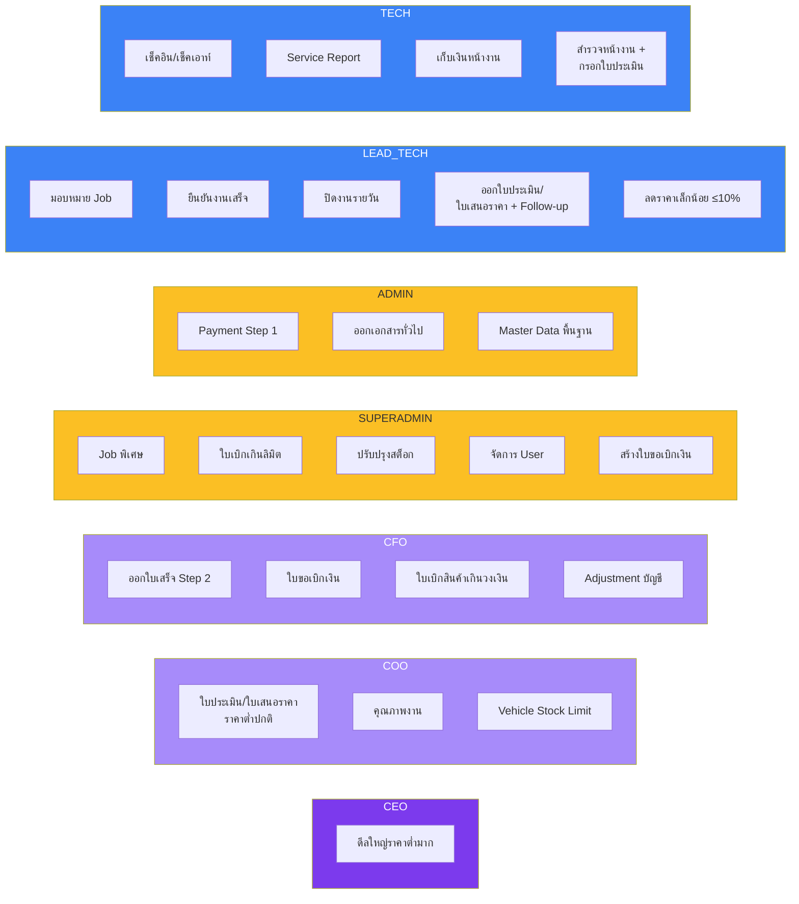

### 2.13 ตารางสรุป Role × Action (Quick Reference)

| Action | CEO | COO | CFO | SUPER | ADMIN | LEAD | TECH |
|---|---|---|---|---|---|---|---|
| ดู Dashboard | ✅ | ✅ | ✅ | ✅ | ✅ | partial | own jobs |
| สร้างลูกค้า | ✅ | ✅ | ✅ | ✅ | ✅ | ✅ | partial |
| ออกใบประเมิน | ❌ | ❌ | ❌ | ✅ | ✅ | ✅ | ✅ (สำรวจ) |
| อนุมัติใบประเมินราคาต่ำ | ✅ | ✅ | ✅ | ❌ | ❌ | ❌ | ❌ |
| ออกใบเสนอราคา | ❌ | ❌ | ❌ | ✅ | ✅ | ✅ | ❌ |
| อนุมัติใบเสนอราคาราคาต่ำ | ✅ | ✅ | ✅ | ❌ | ❌ | ❌ | ❌ |
| ลดราคา ≤10% | ❌ | ❌ | ❌ | ✅ | ❌ | ✅ | ❌ |
| ติดตามลูกค้า (Follow-up) | ❌ | ❌ | ❌ | ✅ | ✅ | ✅ | ❌ |
| สร้างสัญญา | ❌ | ❌ | ❌ | ✅ | ✅ | ❌ | ❌ |
| ออกใบแจ้งหนี้ | ❌ | ❌ | ❌ | ✅ | ✅ | ❌ | ❌ |
| Payment Step 1 | ❌ | ❌ | ❌ | ✅ | ✅ | ❌ | ❌ |
| Payment Step 2 (ออกใบเสร็จ) | ❌ | ❌ | ✅ | ❌ | ❌ | ❌ | ❌ |
| มอบหมาย Job | ❌ | ✅ | ❌ | ✅ | partial | ✅ | ❌ |
| อนุมัติ Job พิเศษ | ✅ | ✅ | ❌ | ✅ | ❌ | ❌ | ❌ |
| เช็คอิน/เช็คเอาท์ Job | ❌ | ❌ | ❌ | ❌ | ❌ | ❌ | ✅ |
| Service Report | ❌ | ❌ | ❌ | ❌ | ❌ | ✅ | ✅ |
| ยืนยันงานเสร็จ | ❌ | ❌ | ❌ | ❌ | ❌ | ✅ | ❌ |
| รับเงินหน้างาน | ❌ | ❌ | ❌ | ❌ | ❌ | ❌ | ✅ |
| ปิด Daily Closure | ❌ | ❌ | ❌ | ❌ | partial | ✅ | ❌ |
| สร้างใบเบิกสินค้า | ❌ | ❌ | ❌ | ✅ | partial | ✅ | ❌ |
| อนุมัติใบเบิกเกินลิมิต | ❌ | ✅ | ❌ | ✅ | ❌ | ❌ | ❌ |
| อนุมัติใบเบิกเกินวงเงิน | ❌ | ❌ | ✅ | ❌ | ❌ | ❌ | ❌ |
| ปรับปรุงสต็อก | ❌ | ❌ | ❌ | ✅ | ❌ | ❌ | ❌ |
| สร้างใบขอเบิกเงิน | ❌ | ❌ | ❌ | ✅ | ❌ | ❌ | ❌ |
| อนุมัติใบขอเบิกเงิน | ❌ | ❌ | ✅ | ❌ | ❌ | ❌ | ❌ |
| จัดการบัญชีบริษัท | ❌ | ❌ | ✅ | partial | ❌ | ❌ | ❌ |
| สร้าง/แก้ User | ❌ | ❌ | ❌ | ✅ | ❌ | ❌ | ❌ |
| จัดการ Master Data | ❌ | ❌ | ❌ | ✅ | partial | ❌ | ❌ |
| ดู Reports การเงิน | ✅ | partial | ✅ | partial | ❌ | ❌ | ❌ |
| ดู Reports การขาย | ✅ | ✅ | ✅ | ✅ | partial | own | ❌ |
| ดู Reports ปฏิบัติการ | ✅ | ✅ | partial | ✅ | partial | own team | ❌ |

**คำอธิบาย:**
- ✅ = ทำได้เต็มที่
- ❌ = ทำไม่ได้
- partial = ทำได้บางส่วน
- own = ดูได้แค่ของตัวเอง

### 2.14 กฎสำคัญที่ต้องจำ

1. **ทุกการอนุมัติบันทึกประวัติ** — ใครอนุมัติ, เมื่อไหร่, ด้วยเหตุผลอะไร
2. **Two-Step Approval** สำหรับการเงิน — Admin ตรวจ → CFO อนุมัติ → ออกใบเสร็จ
3. **Separation of Duties** — คนสร้างใบขอเบิก (SUPERADMIN) ≠ คนอนุมัติ (CFO)
4. **TECH ไม่ตัดสินใจราคา** — งานเพิ่ม ลด ต้องผ่าน LEAD_TECH/Admin
5. **Daily Closure บังคับ** — ทุกทีมต้องปิดงานทุกวัน
6. **Role-Account Mapping** — ใครมีสิทธิ์รับเงินจากบัญชีไหน
7. **ลูกค้าเห็นแค่ของตัวเอง** — privacy strict

---

## บทที่ 3 — ข้อมูลลูกค้า (Customer Master)

### 3.1 ทำไมต้องมีข้อมูลลูกค้า?

ลูกค้าเป็น**ศูนย์กลาง**ของระบบ ทุกเอกสาร (ใบประเมิน, ใบเสนอราคา, สัญญา, ใบแจ้งหนี้) ต้องผูกกับลูกค้าคนหนึ่ง

### 3.2 ประเภทลูกค้า

| ประเภท | ตัวอย่าง | ฟิลด์เพิ่ม |
|---|---|---|
| **บุคคลธรรมดา (PERSONAL)** | บ้านพักอาศัย | คำนำหน้า, ชื่อ-นามสกุล, ชื่อเล่น, เพศ |
| **นิติบุคคล (CORPORATE)** | บริษัท ห้างหุ้นส่วน โรงงาน | ชื่อบริษัท + ผู้ติดต่อ |

### 3.3 ข้อมูลที่ระบบเก็บเกี่ยวกับลูกค้า

**ข้อมูลพื้นฐาน:**
- ประเภทลูกค้า (บุคคล/นิติบุคคล) — **บังคับกรอก**
- ชื่อ-นามสกุล — **บังคับ**
- ชื่อเล่น (ใช้เรียกตอนสนทนา)
- เพศ (ชาย/หญิง/อื่นๆ)
- รหัสลูกค้า — ระบบสร้างให้อัตโนมัติ (8 ตัวอักษร)
- สถานะ (ใช้งาน/ไม่ใช้งาน)

**เลขประจำตัว:**
- เลขประจำตัวผู้เสียภาษี (Tax ID) — ใช้สำหรับออกใบกำกับภาษี
- LINE User ID — ผูกกับ LINE Official Account

**เบอร์โทรศัพท์:** ระบบรองรับ**สูงสุด 6 เบอร์** เพราะลูกค้าหลายคนมีหลายเบอร์ (เบอร์บ้าน, มือถือ, เบอร์ลูกชาย, เบอร์แม่บ้าน ฯลฯ)
- เบอร์โทรหลัก — **บังคับ**
- มือถือ
- เบอร์ 3, 4, 5, 6 (สำรอง)
- บุคคลติดต่อ + เบอร์โทรของบุคคลติดต่อ (เผื่อลูกค้าหลัก ติดต่อไม่ได้)
- อีเมล

**ที่อยู่ (รูปแบบที่อยู่ไทย):**
- เลขที่ — **บังคับ**
- ซอย
- ถนน
- ตำบล/แขวง — **บังคับ**
- อำเภอ/เขต — **บังคับ**
- จังหวัด — **บังคับ**
- รหัสไปรษณีย์ — **บังคับ**
- ประเทศ (default ไทย)

**ข้อมูลการให้บริการ:** ใช้สำหรับจัดเส้นทางช่าง
- เขต (Zone) เช่น "เขต A", "เขตกรุงเทพเหนือ"
- กลุ่มเส้นทาง (Group) เช่น "กลุ่มจันทร์-พฤหัส"
- เส้นทาง (Route)
- ลำดับในเส้นทาง
- ลิงก์ Google Maps — **บังคับ** เพื่อให้ช่างหาบ้านเจอ

### 3.4 ตัวอย่างจริง

```
รหัส: CUS00001
ประเภท: บุคคลธรรมดา
ชื่อ: คุณสมชาย ใจดี (ชื่อเล่น: เฮีย)
Tax ID: 1234567890123
เบอร์หลัก: 02-123-4567 (บ้าน)
มือถือ: 081-234-5678
เบอร์ 3: 081-999-8888 (ภรรยา)
ที่อยู่: 123/45 ซอยสุขุมวิท 21
        ตำบลคลองตันเหนือ อำเภอวัฒนา
        จังหวัดกรุงเทพมหานคร 10110
Google Maps: https://goo.gl/maps/xxxxx
เขต: กรุงเทพใต้ | กลุ่ม: จันทร์-พฤหัส | ลำดับ: 12
```

---

## บทที่ 4 — กระบวนการขาย ช่วงที่ 1: สำรวจหน้างาน → ใบประเมิน

### 4.1 ก่อนเริ่ม — ลูกค้ามาจากไหน?

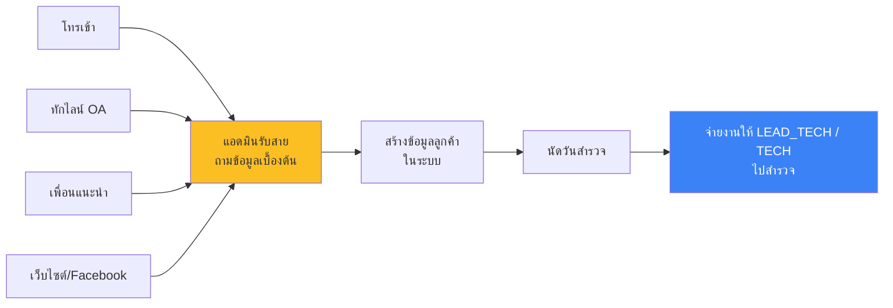

### 4.2 ขั้นตอนการสำรวจหน้างาน

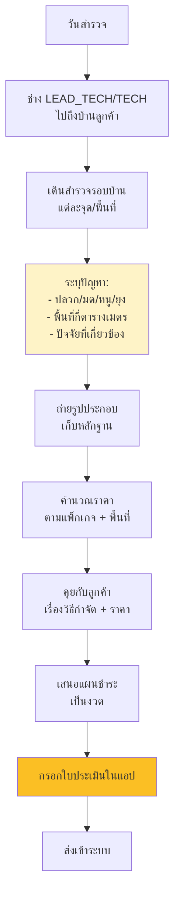

### 4.3 ข้อมูลที่บันทึกในใบประเมิน

#### ข้อมูลส่วนหัว (Header)
- **ลูกค้า** — เลือกจากรายชื่อหรือสร้างใหม่
- **วันที่นัดหมาย** — วันที่ออกสำรวจ
- **แพ็กเกจ** — แพ็กเกจมาตรฐานที่ใช้ (ถ้ามี เช่น "แพ็กเกจกำจัดปลวก Premium 1 ปี")
- **ราคารวมทั้งใบ** — สรุปยอดสุดท้าย
- **วิธีชำระเงิน** — โอน, เงินสด, บัตรเครดิต, เช็ค, QR, แบ่งงวด

#### ข้อมูลที่อยู่ (สถานที่ให้บริการ)
**สำคัญ:** อาจไม่ใช่ที่อยู่เดียวกับที่อยู่ลูกค้า (เช่นลูกค้าอยู่บ้าน แต่จ้างกำจัดปลวกที่โรงงาน)
- ที่อยู่ (เลขที่ + ซอย)
- ตำบล/อำเภอ/จังหวัด/รหัสไปรษณีย์
- เขต/กลุ่มเส้นทาง/เส้นทาง — สำหรับวางเส้นทางช่าง
- ลิงก์ Google Maps — **บังคับ**

#### ข้อมูลพื้นที่ที่สำรวจ (Areas)
หนึ่งใบประเมินมีหลายพื้นที่ได้ เช่น "ห้องครัว", "ห้องน้ำชั้น 1", "โรงรถ"

**แต่ละพื้นที่บันทึก:**
- **ชื่อพื้นที่** (ห้องครัว, ห้องนอน, ฯลฯ)
- **ประเภทอาคาร:** บ้าน, คอนโด, ออฟฟิศ, โรงงาน, อื่นๆ
- **ระบบบริการ:** ภายใน (internal), ภายนอก (external), อื่นๆ
- **ขนาดพื้นที่** ตารางเมตร — **บังคับ**
- **จำนวนครั้งบริการต่อปี** เช่น "4 ครั้ง"
- **ราคาบริการพื้นที่นี้**
- **ราคาแพ็กเกจ + ประเภทแพ็กเกจ** (Standard / Premium)
- **รูปภาพประกอบ** ของพื้นที่นี้

**ประเภทบริการที่เลือกได้ในแต่ละพื้นที่:**
- กำจัดปลวก
- กำจัดมด/แมลงสาบ
- กำจัดหนู
- กำจัดยุง
- อื่นๆ (ระบุ)

**รายการสารเคมี/อุปกรณ์ที่ใช้ในแต่ละพื้นที่:**
- ชื่อสารเคมี/ผลิตภัณฑ์
- ปริมาณที่ใช้ + หน่วย (ลิตร, ขวด, กก.)
- ราคาต่อหน่วย
- ราคารวม

#### แผนการชำระเงิน (Installments)
ลูกค้าจ่ายเป็นงวด ระบบบันทึก:
- **งวดที่** (1, 2, 3, ...)
- **จำนวนเงิน** ของงวดนี้
- **หมายเหตุ** (เช่น "ก่อนเริ่มงาน", "หลังครั้งที่ 1")

**ตัวอย่างจริง:**
```
ใบประเมิน AS6800001
ลูกค้า: คุณสมชาย ใจดี
ราคารวม: 36,000 บาท

พื้นที่ที่ 1: โรงรถ (50 ตร.ม.)
  - กำจัดปลวก (4 ครั้ง/ปี)
  - สารเคมี: น้ำยาฉีดปลวก 2 ลิตร @ 800 = 1,600
  - ราคาพื้นที่: 12,000

พื้นที่ที่ 2: ห้องครัว (15 ตร.ม.)
  - กำจัดมด/แมลงสาบ (12 ครั้ง/ปี)
  - เจลกำจัดมด 3 หลอด @ 300 = 900
  - ราคาพื้นที่: 14,000

พื้นที่ที่ 3: รอบบ้าน
  - กำจัดยุง (4 ครั้ง/ปี)
  - ราคาพื้นที่: 10,000

แผนงวด:
  งวดที่ 1: 9,000 (ก่อนเริ่มงาน)
  งวดที่ 2: 9,000 (หลังครั้งที่ 1)
  งวดที่ 3: 9,000 (หลังครั้งที่ 2)
  งวดที่ 4: 9,000 (หลังครั้งที่ 3)
```

### 4.4 การอนุมัติใบประเมิน (ถ้าราคาต่ำ)

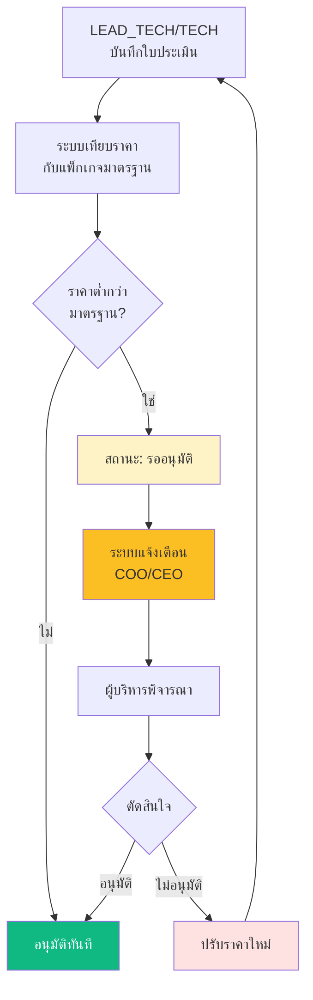

**เหตุผลที่ต้องอนุมัติ:**
- ป้องกัน LEAD_TECH/TECH ลดราคาให้ลูกค้ามากเกินไปจนบริษัทขาดทุน
- COO/CEO ต้องเห็นว่ามีการต่อรองราคาที่ไหนบ้าง
- ถ้าทุกใบเสนอราคาต่ำ → อาจมีปัญหากำลังการขาย

### 4.5 หลังใบประเมินผ่าน

ระบบบันทึก:
- ใบประเมินสถานะ "**อนุมัติแล้ว**"
- ประวัติการอนุมัติ (ใครอนุมัติ เมื่อไหร่)
- ใบประเมินพร้อมแปลงเป็น**ใบเสนอราคา**

---

## บทที่ 5 — กระบวนการขาย ช่วงที่ 2: ใบเสนอราคา

### 5.1 ความแตกต่าง: ใบประเมิน vs ใบเสนอราคา

| | ใบประเมิน | ใบเสนอราคา |
|---|---|---|
| ผู้เห็น | ภายในบริษัท | **ส่งให้ลูกค้า** |
| รายละเอียด | ภายในการคำนวณ | สรุปสะอาด พร้อมส่งลูกค้า |
| ภาษา | ภาษาบ้านๆ | เป็นทางการ |
| ลายเซ็นลูกค้า | ไม่มี | **มีช่องเซ็น** |
| VAT | คำนวณภายใน | **แสดงชัดเจน** |

### 5.2 การสร้างใบเสนอราคา

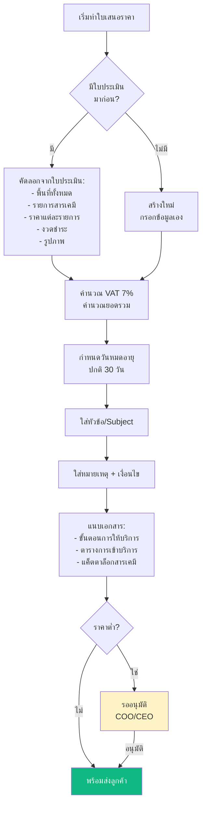

### 5.3 ข้อมูลในใบเสนอราคา

#### ข้อมูลหัวเอกสาร
- **รหัสใบเสนอราคา** — ระบบสร้างให้ (เช่น QT6800001)
- **ลูกค้า** — ชื่อลูกค้า (คัดลอกจากระบบ)
- **ใบประเมินอ้างอิง** (ถ้าทำต่อจากใบประเมิน)
- **รุ่นที่ (Revision)** — ปกติเริ่มที่ 1, ถ้าแก้ไขจะเพิ่มเป็น 2, 3, ...
- **สถานะ** — ร่าง / รอเซ็น / เซ็นแล้ว / ปฏิเสธ / ยกเลิก

#### ข้อมูลการให้บริการ
- **สถานที่ให้บริการ**
- **ระยะเวลาสัญญา** เช่น "1 ปี"
- **จำนวนครั้งเข้าบริการ** เช่น "7 ครั้ง"
- **เงื่อนไขการชำระเงิน** (เช่น "30 วันหลังจบงาน")
- **หมายเหตุ**
- **ลิงก์ Google Maps**
- **เบอร์โทรติดต่อ**

#### ข้อมูลเงิน
- **ราคารวมก่อน VAT** (Subtotal)
- **VAT 7%** (คำนวณอัตโนมัติ)
- **รวม VAT หรือไม่** (boolean) — บางลูกค้าไม่ต้องการ VAT
- **ยอดรวมสุดท้าย** (Total)
- **วันหมดอายุ** — ปกติ 30 วัน หลังจากนี้ราคาอาจเปลี่ยน
- **หัวข้อเสนอราคา** (Subject)
- **หมายเหตุท้ายเอกสาร** (Footer)

#### ข้อมูลลายเซ็น
- ลูกค้าเซ็นแล้วหรือยัง (boolean)
- วันเวลาที่เซ็น
- ชื่อผู้เซ็น
- รูปลายเซ็น (Base64)
- ช่องทางที่เซ็น: **หน้างาน** (กระดาษ) หรือ **ออนไลน์** (Portal/LINE)
- IP ที่เซ็น (กันปลอม)
- User Agent (browser/device ที่ใช้)
- เหตุผลที่ไม่เซ็น (ถ้าปฏิเสธ)

#### การติดตาม
- **จำนวนครั้งติดตาม** — เช่น LEAD_TECH โทรไปติดตาม 3 ครั้งแล้ว
- **เหตุผลการยกเลิก** (ถ้ายกเลิก)

### 5.4 ส่งใบเสนอราคาให้ลูกค้า

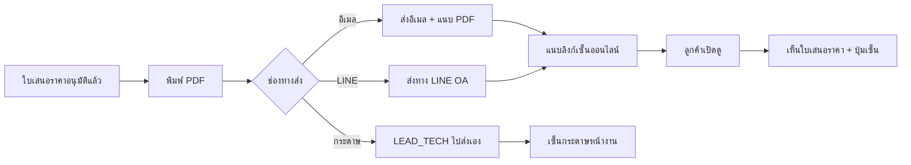

### 5.5 การลูกค้าเซ็นเอกสาร (3 ช่องทาง)

#### ช่องทางที่ 1: เซ็นออนไลน์ผ่าน Portal
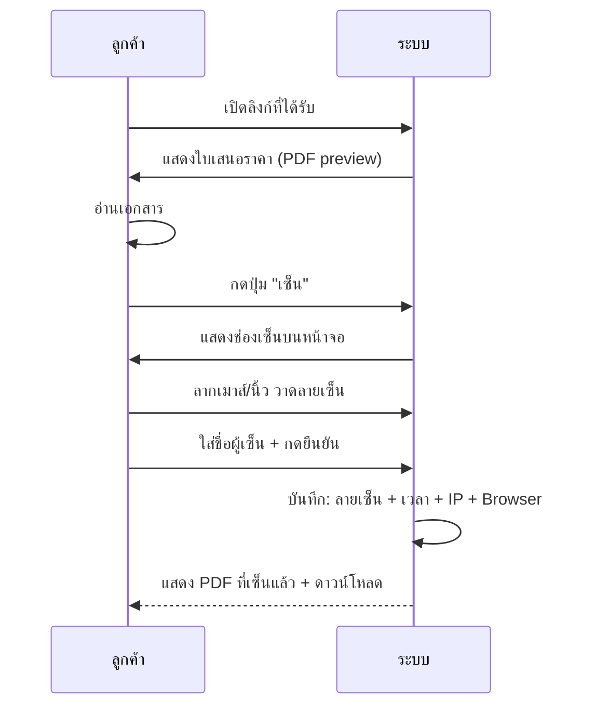

#### ช่องทางที่ 2: เซ็นผ่าน LINE LIFF
- ลูกค้าเปิดลิงก์ใน LINE → LIFF เปิด mini app
- กระบวนการเหมือน Portal แต่ใน LINE
- ระบบรู้ว่าเป็น LINE User ไหน (line_user_id)

#### ช่องทางที่ 3: เซ็นกระดาษหน้างาน
- LEAD_TECH พิมพ์ใบเสนอราคา
- ไปให้ลูกค้าเซ็นปากกาที่บ้าน
- LEAD_TECH ถ่ายรูปกลับมาอัปโหลด
- ระบบบันทึก `signed_via = ON_SITE`

### 5.6 หลังลูกค้าเซ็น


### 5.7 กรณีลูกค้าขอแก้ราคา (Revision)

ถ้าลูกค้าต่อรอง:
1. LEAD_TECH กดปุ่ม "Revise"
2. ระบบสร้างใบเสนอราคาฉบับใหม่ — **เลขเดียวกัน + revision +1** (เช่น QT6800001 Rev.2)
3. ระบบ link ใบเก่ากับใบใหม่ผ่าน `original_id`
4. แก้ราคา → ส่งใหม่ → ลูกค้าเซ็น

**ทำไมต้องเก็บรุ่นเก่า?** — เพื่อตรวจสอบประวัติการต่อรอง

---

## บทที่ 6 — กระบวนการขาย ช่วงที่ 3: เซ็นสัญญา

### 6.1 สัญญาเกิดขึ้นเมื่อไหร่?

ทันทีที่ลูกค้าเซ็นใบเสนอราคา → ระบบสร้างสัญญาให้อัตโนมัติ

### 6.2 ข้อมูลในสัญญา

#### ส่วนหัว
- **รหัสสัญญา** (เช่น CT6800001)
- **ลูกค้า**
- **ใบเสนอราคาอ้างอิง**
- **สถานะ** — ร่าง / รอเซ็น / เซ็นแล้ว / กำลังใช้งาน / เสร็จสิ้น / ยกเลิก

#### ข้อมูลเงิน
- **ยอดรวมสัญญา**
- **VAT**
- **เป็นสัญญาแยกหรือไม่** (Separate Contract)

#### ระยะเวลา
- **วันเริ่มสัญญา** (Start Date) — **บังคับ**
- **วันสิ้นสุดสัญญา** (End Date) — **บังคับ**
- **ตารางการเข้าบริการ** ผูกกับสัญญานี้

#### ลายเซ็น (2 ฝ่าย)
- **ลายเซ็นลูกค้า** (เหมือนในใบเสนอราคา)
- **ลายเซ็นผู้แทนบริษัท** (Contractor Signer) — กรรมการ/ผู้มีอำนาจของบริษัท MrGreenPest

### 6.3 ตารางการเข้าบริการ (Service Schedule)

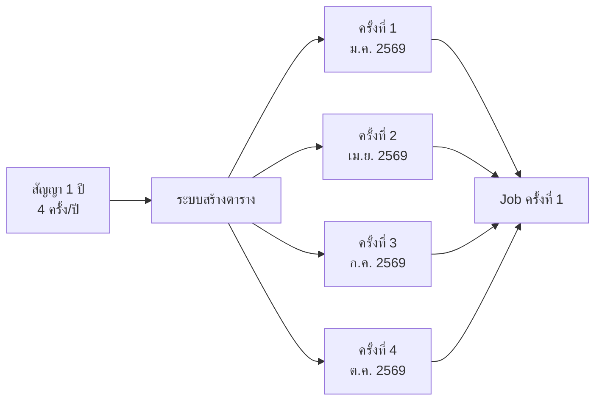

**สิ่งที่ตารางการเข้าบริการกำหนด:**
- จำนวนครั้งเข้าบริการต่อปี
- ความถี่ (รายเดือน/รายไตรมาส)
- ช่วงเวลาที่ลูกค้าต้องการ (เช่น "เช้าเท่านั้น")
- จะใช้ทำอะไรในแต่ละครั้ง (เช่น "เติมเหยื่อ", "ฉีดสเปรย์", "ตรวจสถานี")

### 6.4 งวดการชำระ (Installments)

แต่ละงวดผูกกับ:
- **ลำดับงวด** (1, 2, 3, ...)
- **จำนวนเงิน** ของงวดนี้
- **กำหนดชำระ** (วันที่ลูกค้าต้องจ่าย)
- **หมายเหตุ** (เช่น "ก่อนเริ่มงาน", "หลังครั้งที่ 1")

**ตัวอย่าง:**
```
สัญญา CT6800001 — 36,000 บาท / ปี

งวดที่ 1: 9,000 บาท (ครบกำหนด 15 ม.ค. 2569)
งวดที่ 2: 9,000 บาท (ครบกำหนด 15 เม.ย. 2569)
งวดที่ 3: 9,000 บาท (ครบกำหนด 15 ก.ค. 2569)
งวดที่ 4: 9,000 บาท (ครบกำหนด 15 ต.ค. 2569)
```

### 6.5 หลังสัญญาเริ่มใช้งาน

ระบบ:
1. สร้าง **Job** สำหรับครั้งแรก (ตามวันใน Service Schedule)
2. ออก **Invoice** งวดที่ 1
3. แจ้งเตือนแอดมินให้มอบหมายช่าง

---

## บทที่ 7 — กระบวนการบริการ: มอบหมายงาน → ทำงาน → ปิดงาน

### 7.1 ภาพรวมวงจร Job

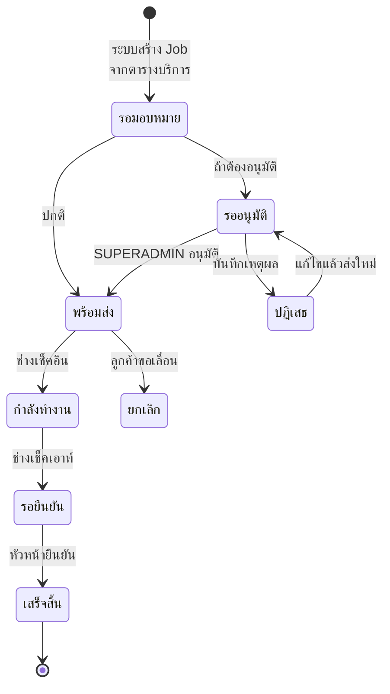

### 7.2 ข้อมูลใน Job

#### ข้อมูลพื้นฐาน
- **ลูกค้า**
- **สัญญาอ้างอิง**
- **ใบประเมินอ้างอิง**
- **ใบแจ้งหนี้อ้างอิง** (ถ้ามี — สำหรับเก็บเงินงวดที่ผูกกับ Job นี้)
- **วันที่นัดหมาย** (Appointment Date)
- **สถานะ**

#### ข้อมูลทีมงาน
- **ช่างหลัก** (Primary Tech) — **บังคับ** เลือกจากรายชื่อช่าง
- **ช่างรอง** (Secondary Tech) — ถ้ามี
- **รถบริการ** (Vehicle) — เลือกจากรายการรถ
- **ลูกทีม** (Team Members) — ช่างเสริมในวันนั้น (Many-to-many)

#### ข้อมูลเวลา
- **วันเริ่มงานตามแผน** (Start Date)
- **วันจบงานตามแผน** (End Date)
- **เวลาเริ่มงานจริง** (Actual Start Time) — บันทึกตอนเช็คอิน
- **เวลาจบงานจริง** (Actual End Time) — บันทึกตอนเช็คเอาท์

#### รายละเอียดงาน
- **หมายเหตุ** (Remark)
- **รายละเอียดปฏิบัติงาน** (Operation Details)
- **เหตุผลการปฏิเสธ** (ถ้าถูกปฏิเสธ)

### 7.3 การมอบหมายงาน

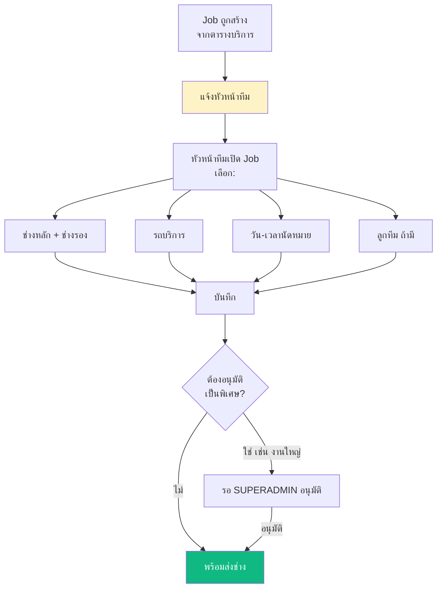

**กรณีที่ต้องอนุมัติเป็นพิเศษ:**
- งานที่ราคาสูงผิดปกติ
- งานนอกพื้นที่ปกติ
- งานที่ทีมมีจำนวนช่างเยอะกว่ามาตรฐาน

### 7.4 ประวัติการปฏิเสธ Job

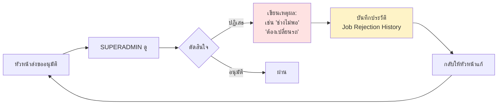

**ระบบเก็บประวัติทุกครั้งที่ปฏิเสธ** — แม้แก้แล้วส่งใหม่ ก็ยังเห็นว่าก่อนหน้าถูกปฏิเสธมาแล้วกี่ครั้ง และเหตุผลคืออะไร

### 7.5 ช่างไปทำงานหน้างาน

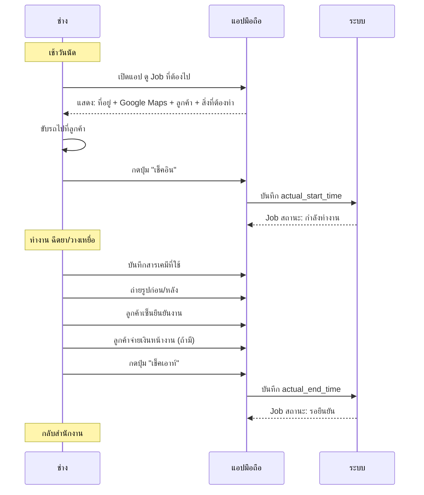

### 7.6 หัวหน้าทีมยืนยันงานเสร็จ

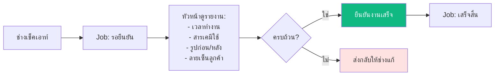

---

## บทที่ 8 — รายงานบริการและการเก็บเงินหน้างาน

### 8.1 รายงานบริการคืออะไร?

ทุกครั้งที่ช่างเข้าทำงาน 1 Job → เกิด 1 รายงานบริการ (Service Report)
รายงานบริการเก็บรายละเอียดทั้งหมดของการทำงานครั้งนั้น

### 8.2 ข้อมูลในรายงานบริการ

#### ข้อมูลหัว
- **Job อ้างอิง** — **บังคับ**
- **ลูกค้า** (snapshot)
- **ใบเสนอราคาอ้างอิง**
- **วันที่ให้บริการ**
- **เวลาเข้า / เวลาออกหน้างาน**

#### ประเภทศัตรูพืชที่ให้บริการ (ติ๊กได้หลายอัน)
- ☐ กำจัดปลวก
- ☐ กำจัดมด/แมลงสาบ
- ☐ กำจัดหนู
- ☐ กำจัดยุง
- ☐ อื่นๆ (ระบุ)

#### วิธีการให้บริการ (ติ๊กได้หลายวิธี)
- ☐ ติดตั้งสถานีเก็บอาหาร (Station)
- ☐ เติมสารเคมีในสถานี (Refill)
- ☐ ใช้สารเคมีทั่วไป (Chemical)
- ☐ ตรวจสอบสถานี (Check)
- ☐ บำบัดใต้ดิน (Underground Treatment)
- ☐ เปลี่ยนสถานีใหม่ (Renew)
- ☐ พ่นสารเคมี (Spray)
- ☐ ฟอกควัน (Fogging)
- ☐ ใช้เจล (Gel)
- ☐ ใช้ผงบ่ม (Powder)
- ☐ ใช้อาหารพิษ (Bait)
- ☐ ติดกับดัก (Trap)
- ☐ อื่นๆ (ระบุ)

#### ผลการทำงาน
- **บันทึกการทำงาน** (Work Note) — เขียนเป็น free text เช่น
  > "พบรังปลวกใต้พื้นห้องน้ำ ฉีดน้ำยา 2 ลิตร เติมเหยื่อ 4 จุด ลูกค้าแจ้งว่าได้กลิ่นน้อยลง"

#### รายละเอียดความเสียหายจากศัตรูพืช (Pest Detail)
- ระดับความรุนแรง (เกรด)
- จุดที่พบ
- สภาพหลังกำจัด

#### ลายเซ็น
- **ลายเซ็นลูกค้า** + ชื่อผู้เซ็น
- **ลายเซ็นช่าง** + ชื่อช่าง

#### การชำระเงินหน้างาน (ถ้ามี)
ถ้าลูกค้าจ่ายเงินตอนช่างไปทำงาน → บันทึกใน Service Report เลย
- **วิธีชำระ:** เงินสด / โอน / บัตรเครดิต / เช็ค / QR / แบ่งงวด
- **จำนวนงวด** (ถ้าเป็นการชำระเป็นงวด)
- **จำนวนเงินที่ชำระ**
- **สลิป/หลักฐาน** (อัปโหลดรูป)
- **ID การชำระเงิน** — link ไปยังตาราง Payment

#### นัดงานครั้งต่อไป
- **วันเวลาบริการครั้งถัดไป**
- **วันที่ลูกค้านัดหมายแน่นอน**
- **วัตถุประสงค์งานต่อไป:**
  - ☐ เติมสาร
  - ☐ เปลี่ยนสาร
  - ☐ ตรวจสอบ
  - ☐ ติดตั้ง/เปลี่ยนสถานี
  - ☐ เปลี่ยนใหม่

#### ไฟล์แนบ
- **ไฟล์ใบเสนอราคา** (สำหรับให้ลูกค้าดู)
- **แบบพิมพ์/แผนผัง** (Blueprint)

### 8.3 การเก็บเงินหน้างาน — กระบวนการละเอียด

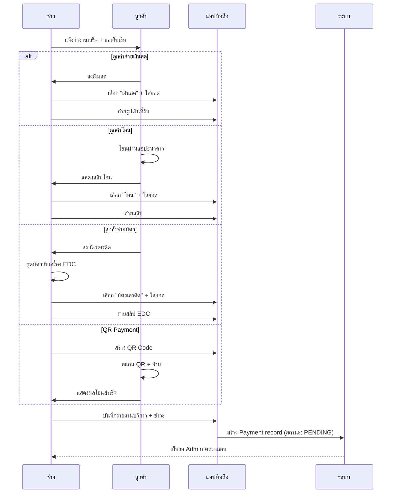

**ทำไมต้องถ่ายสลิป?** — เพื่อให้แอดมินตรวจสอบได้ว่าเงินเข้าจริง ป้องกันช่างเอาเงินไป

### 8.4 หลังรายงานบริการ

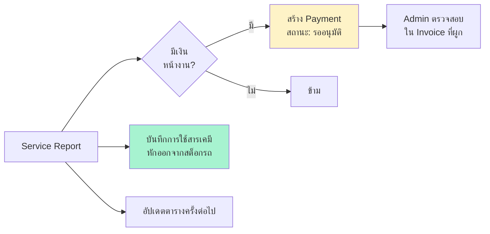

---

## บทที่ 9 — ปิดงานรายวัน (Daily Closure)

### 9.1 ทำไมต้องปิดงานรายวัน?

**ปัญหา:** ช่างไปทำงานทั้งวัน เก็บเงินมาหลายที่ ค่าใช้จ่ายระหว่างทาง (น้ำมัน, ค่าทางด่วน) ถ้าไม่สรุปทุกวัน → เงินหาย, ตัวเลขเพี้ยน, ตรวจสอบยาก

**การปิดงานรายวัน** = บัญชี/แอดมิน เช็คทุกอย่างของวันนั้นให้ตรงกัน

### 9.2 ขั้นตอนปิดงานรายวันแบบละเอียด

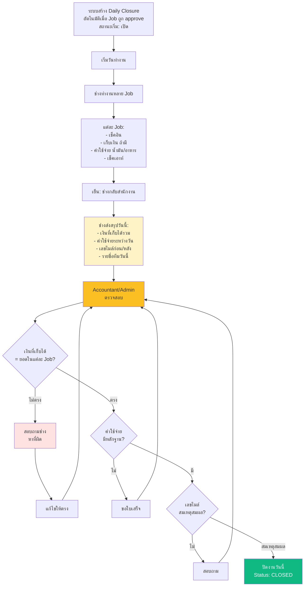

### 9.3 ข้อมูลในการปิดงานรายวัน

**สำหรับแต่ละทีม/รถ ในแต่ละวัน:**
- **เงินสดที่เก็บได้รวม** (จากทุก Job ของวันนั้น)
- **สลิปโอนที่รับ** (รวมจากทุก Job)
- **ค่าใช้จ่ายระหว่างวัน:**
  - ค่าน้ำมัน
  - ค่าทางด่วน
  - ค่าอาหาร
  - ค่าซื้อของฉุกเฉิน
  - อื่นๆ
- **เลขไมล์รถ:** เริ่มวัน vs จบวัน
- **สมาชิกทีมวันนั้น** (เช่น "ช่างเอก + ช่างบี + ช่างซี")
- **ใบเบิกสินค้าที่สร้างในวันนั้น** (ถ้ามี)

### 9.4 การยืนยันว่า "ไม่มีใบเบิกสินค้าวันนี้"

**กรณีพิเศษ:** บางวันช่างไปทำงานแต่ไม่ใช้สารเคมีเลย (เช่น ไปแค่ตรวจ)

→ หัวหน้าต้อง**ยืนยัน**ในระบบว่า "ไม่มีการเบิกสินค้าวันนี้" ก่อนปิดงานได้
→ ถ้าไม่ยืนยันและไม่มีใบเบิก → ระบบไม่ให้ปิด (กันลืม)

### 9.5 ปิดย้อนหลัง

ถ้าจะปิดงานของวันก่อน → **ต้องไม่มีใบเบิกสินค้ารออนุมัติ** (กันการแก้ตัวเลขย้อนหลัง)

---

## บทที่ 10 — ใบแจ้งหนี้และการชำระเงิน

### 10.1 ใบแจ้งหนี้เกิดขึ้นเมื่อไหร่?

```mermaid
flowchart LR
    Auto[ระบบสร้างใบแจ้งหนี้<br/>ตามตารางงวดในสัญญา] --> Send[แอดมินส่งให้ลูกค้า]
    Send --> Wait[รอลูกค้าจ่าย]

    style Auto fill:#fbbf24
```

**ตัวอย่าง:** สัญญา 4 งวด → ระบบสร้างใบแจ้งหนี้ 4 ใบ ตามวันครบกำหนดของแต่ละงวด

### 10.2 ข้อมูลในใบแจ้งหนี้

#### ส่วนหัว
- **รหัส** (เช่น INV6800001)
- **ลูกค้า**
- **ใบเสนอราคาอ้างอิง**
- **สัญญาอ้างอิง**
- **งวดที่อ้างอิง** (เช่น "งวด 2 จาก 4")
- **เทอม** (Term) — งวดที่
- **ลำดับการออกบิล** (Billing Count) — ออกครั้งที่กี่ของงวดนี้
- **ทบยอดมาจาก** (Carried Over From) — ถ้าเป็นการทบยอดจากใบเก่า

#### ข้อมูลเงิน
- **ยอดก่อน VAT**
- **VAT**
- **รวม VAT หรือไม่**
- **ยอดรวม**
- **ยอดที่ชำระแล้ว** (Paid Amount) — อัปเดตเมื่อมีการจ่าย
- **วันที่ออกใบ**
- **วันครบกำหนด** (Due Date)
- **หมายเหตุ**

#### รายการบิล (Invoice Items)
- รายละเอียด (เช่น "ค่าบริการกำจัดปลวก งวด 1 ของ 4")
- จำนวน
- หน่วย
- ราคาต่อหน่วย
- จำนวนเงิน

#### การขอหนังสือกำกับภาษี (Tax Invoice)
**สำหรับนิติบุคคล** ที่ต้องการใบกำกับภาษี:
- ขอหนังสือกำกับภาษีหรือไม่ (boolean)
- ชื่อในหนังสือกำกับภาษี (อาจไม่ใช่ชื่อลูกค้าหลัก เช่น ชื่อบริษัทแม่)
- ที่อยู่ในหนังสือกำกับภาษี
- เลขประจำตัวผู้เสียภาษี

### 10.3 วิธีการชำระเงินที่รองรับ

| วิธี | คำอธิบาย | หลักฐานที่ต้องการ |
|---|---|---|
| **เงินสด (CASH)** | ลูกค้าจ่ายเป็นเงินสด | รูปเงิน + ระบุยอด |
| **โอน (TRANSFER)** | โอนผ่านธนาคาร/แอป | สลิปโอน |
| **บัตรเครดิต (CREDIT_CARD)** | รูดบัตรกับเครื่อง EDC | สลิป EDC |
| **เช็ค (CHEQUE)** | จ่ายด้วยเช็ค | รูปเช็ค + เลขที่เช็ค |
| **QR Payment (QR_PAYMENT)** | สแกน QR PromptPay | รูปจอแสดงผลโอน |
| **แบ่งจ่าย (DIVIDED)** | แบ่งจ่ายหลายวิธีในครั้งเดียว เช่น เงินสด 5,000 + โอน 4,000 | หลักฐานแต่ละส่วน |
| **ผ่อนชำระ (INSTALLMENT)** | ผ่อนกับสถาบันการเงิน | สัญญาผ่อนชำระ |

### 10.4 กระบวนการรับเงิน — 2-Step Approval

ระบบใช้ **2-Step Approval** เพื่อป้องกันการทุจริต

```mermaid
sequenceDiagram
    participant L as ลูกค้า
    participant T as ช่าง/Admin
    participant Adm as Admin
    participant CFO as CFO
    participant Bank as ระบบบัญชี

    L->>T: ชำระเงิน (ใดๆ วิธีหนึ่ง)
    T->>T: ถ่ายหลักฐาน
    T->>Sys: บันทึกใน Payment<br/>สถานะ: PENDING_REVIEW

    Note over Adm: STEP 1: Admin Review
    Adm->>Sys: ดู Payment ที่รออนุมัติ
    Adm->>Sys: ตรวจสลิป<br/>+ ระบุบัญชีปลายทาง (Account)
    Adm->>Sys: กดอนุมัติ Step 1
    Sys-->>Sys: Invoice → PENDING_ACCOUNTING_REVIEW
    Sys->>CFO: แจ้งเตือนรอ CFO อนุมัติ

    Note over CFO: STEP 2: CFO Review
    CFO->>Bank: เช็คยอดเข้าบัญชีจริง
    alt ตัวเลขตรง
        CFO->>Sys: กดอนุมัติ Step 2
        Sys->>Sys: สร้าง Receipt (สถานะ: ISSUED)
        Sys->>Sys: สร้าง AccountTransaction (DEPOSIT)
        Sys-->>L: ส่ง Receipt ให้ลูกค้า
    else ตัวเลขไม่ตรง
        CFO->>Sys: ปฏิเสธ + เหตุผล
        Sys->>Sys: Invoice กลับเป็น PENDING_REVIEW
        Sys->>Sys: Payment สถานะ: REJECTED
        Sys->>Adm: แจ้งเตือนให้ตรวจซ้ำ
    end
```

**ขั้นที่ 1 — Admin:**
- ตรวจสอบสลิป/หลักฐานที่ช่างถ่ายมา
- ระบุว่าเงินจะเข้าบัญชีไหน (เช่น "บัญชี SCB หลัก", "บัญชี KBank ออม")
- ถ้าผ่าน → ส่งต่อให้ CFO

**ขั้นที่ 2 — CFO:**
- เช็คยอดในบัญชีจริง (ดูใน internet banking)
- ถ้าตรง → ออกใบเสร็จ + บันทึกเงินเข้า
- ถ้าไม่ตรง → ปฏิเสธ ส่งกลับ

### 10.5 การจัดสรรเงินเข้างวด (Payment Allocation)

```mermaid
flowchart TD
    Pay[ลูกค้าจ่าย 18,000] --> FIFO[จัดสรรแบบ FIFO]
    FIFO --> G1[งวด 1 ค้าง: 9,000]
    G1 --> Fill1[จ่ายงวด 1 เต็ม<br/>เหลือ 9,000]
    Fill1 --> G2[งวด 2 ค้าง: 9,000]
    G2 --> Fill2[จ่ายงวด 2 เต็ม<br/>เหลือ 0]
    Fill2 --> Done[งวด 1, 2 = PAID]

    style Pay fill:#10b981,color:#fff
    style Done fill:#10b981,color:#fff
```

**กฎ FIFO (First In First Out):**
- ลูกค้าจ่ายมา 1 ก้อน → ระบบจัดสรรเข้างวดเก่าที่สุดก่อน
- งวดเก่าจะเต็มก่อน → ค่อยไปงวดถัดไป
- ถ้าจ่ายไม่พอ → งวดสุดท้ายเป็น "ชำระบางส่วน" (Partial)

### 10.6 การทบยอด (Carry Over)

ถ้าลูกค้าไม่จ่ายงวดเก่าก่อนถึงงวดใหม่:
- ใบแจ้งหนี้งวดเก่า → สถานะ "ทบยอดแล้ว" (CARRIED_OVER)
- ใบแจ้งหนี้งวดใหม่ → รวมยอดเก่า + ยอดใหม่
- ระบบจำว่าทบยอดมาจากใบไหน (carried_over_to_id)

---

## บทที่ 11 — ใบเสร็จและบัญชีบริษัท

### 11.1 ใบเสร็จเกิดขึ้นเมื่อไหร่?

```mermaid
flowchart LR
    CFO[CFO อนุมัติการชำระ<br/>Step 2] --> Issue[ระบบออกใบเสร็จ<br/>อัตโนมัติ]
    Issue --> Bank[สร้าง AccountTransaction<br/>เงินเข้าบัญชีที่กำหนด]

    style Issue fill:#10b981,color:#fff
    style Bank fill:#059669,color:#fff
```

### 11.2 ประเภทใบเสร็จ

| สถานะ | ความหมาย |
|---|---|
| **ร่าง (DRAFT)** | สร้างไว้แต่ยังไม่ออก |
| **ออกแล้ว (ISSUED)** | ออกอย่างเป็นทางการ ส่งให้ลูกค้า |
| **ยกเลิก (CANCELLED)** | ยกเลิกใบนี้ (ผิดพลาด) |
| **โมฆะ (VOIDED)** | ทำให้เป็นโมฆะ (เช่น ออกผิด ต้องออกใหม่) |

### 11.3 บัญชีบริษัท (Account)

บริษัทมีหลายบัญชีธนาคาร แต่ละบัญชีมี:
- **ชื่อบัญชี** (เช่น "SCB หลัก", "KBank สำหรับเก็บเช็ค")
- **ประเภทบัญชี:**
  - ออมทรัพย์ (SAVINGS)
  - กระแสรายวัน (CURRENT)
  - ฝากประจำ (FIXED)
  - อื่นๆ (OTHER)
- **เลขที่บัญชี**
- **ธนาคาร**
- **สถานะ** (Active/Inactive)

### 11.4 ประเภทธุรกรรมในบัญชี (Account Transaction)

```mermaid
flowchart TB
    Acc[บัญชีบริษัท]
    Acc --> Dep[DEPOSIT<br/>เงินเข้า]
    Acc --> With[WITHDRAW<br/>เงินออก]
    Acc --> Trf[TRANSFER<br/>โอนระหว่างบัญชี]
    Acc --> Adj[ADJUSTMENT<br/>ปรับยอด]

    Dep -->|มาจาก| R[ใบเสร็จที่ออกแล้ว]
    With -->|มาจาก| W[ใบขอเบิกที่อนุมัติ]
    Trf -->|จาก| A1[บัญชี A]
    Trf -->|ไป| A2[บัญชี B]
    Adj -->|ต้องระบุ| Reason[เหตุผล + Remark]

    style Acc fill:#fbbf24
```

**ทุกธุรกรรมต้องมีหลักฐาน:**
- DEPOSIT ↔ ผูกกับใบเสร็จ
- WITHDRAW ↔ ผูกกับใบขอเบิกที่อนุมัติแล้ว
- ADJUSTMENT ↔ ต้องระบุเหตุผล (เช่น "แก้เนื่องจากบันทึกผิดเดือนก่อน")

### 11.5 ยอดคงเหลือบัญชี

ระบบคำนวณยอดคงเหลือ = ผลรวมของธุรกรรมทั้งหมด (real-time)

**หน้า Dashboard บัญชี:** CFO เห็นยอดทุกบัญชีตอนนี้ + ประวัติธุรกรรมทั้งหมด

### 11.6 การผูกบัญชีกับบทบาท (Role-Account)

**ปัญหา:** บริษัทมีหลายบัญชี ใครรับเงินจากใคร?

**วิธีแก้:** กำหนด Role-Account mapping
- CFO ดูแลบัญชี A
- ผู้จัดการสาขา 1 ดูแลบัญชี B
- ผู้จัดการสาขา 2 ดูแลบัญชี C

→ เมื่อใบขอเบิกถูกสร้าง ระบบจะรู้ว่าควรเบิกจากบัญชีไหน

---

## บทที่ 12 — การเบิกเงินภายในบริษัท

### 12.1 ใครเบิกเงินอะไรได้บ้าง?

**ใครเบิกได้:** เฉพาะ **SUPERADMIN** (เพื่อควบคุม)

**ตัวอย่างที่เบิกบ่อย:**
- ค่าน้ำมันรถบริการ
- ค่าซื้อสารเคมีเร่งด่วน
- ค่าจ้างชั่วคราว
- ค่าซ่อมรถ
- เงินทอนเก็บจากลูกค้า

### 12.2 ขั้นตอนเบิกเงินแบบละเอียด

```mermaid
sequenceDiagram
    participant Req as SUPERADMIN<br/>ผู้ขอเบิก
    participant Sys as ระบบ
    participant CFO as CFO

    Req->>Sys: สร้างใบขอเบิก<br/>+ รายการที่ขอ<br/>+ จำนวนเงินรวม
    Sys->>Sys: กำหนด destination_account<br/>อัตโนมัติจาก Role-Account ของผู้ขอ
    Sys->>CFO: แจ้งเตือนรออนุมัติ
    Sys-->>Req: สถานะ: PENDING

    Note over CFO: CFO พิจารณา
    CFO->>Sys: ดูรายการ + เหตุผล
    alt อนุมัติ
        CFO->>Sys: เลือก source_account<br/>(บัญชีที่จะตัดเงินออก)
        CFO->>Sys: กดอนุมัติ
        Sys->>Sys: สร้าง AccountTransaction (WITHDRAW)<br/>ตัดเงินจาก source_account
        Sys-->>Req: สถานะ: APPROVED + จ่ายเงิน
    else ปฏิเสธ
        CFO->>Sys: ใส่เหตุผลปฏิเสธ
        Sys-->>Req: สถานะ: REJECTED + เหตุผล
    end
```

### 12.3 ข้อมูลในใบขอเบิก

#### ส่วนหัว
- **รหัสใบเบิก** (เช่น CWR6900007)
- **ผู้ขอเบิก** (เป็น SUPERADMIN เท่านั้น)
- **บัญชีปลายทาง** (Destination Account) — อัตโนมัติตาม Role-Account
- **บัญชีต้นทาง** (Source Account) — CFO ระบุตอนอนุมัติ
- **หมายเหตุการขอเบิก**
- **สถานะ**

#### รายการเบิก (Items)
แต่ละรายการ:
- **รายละเอียด** เช่น "ค่าน้ำมันรถบริการเดือน พ.ค."
- **จำนวนเงิน**

#### การอนุมัติ
- **ผู้อนุมัติ** (CFO)
- **วันเวลาอนุมัติ**
- **เหตุผลการปฏิเสธ** (ถ้าปฏิเสธ)

### 12.4 ตัวอย่างใบขอเบิกจริง

```
ใบขอเบิกเงิน CWR6900007
ผู้ขอ: คุณริคาร์โด ไมลอส (SUPERADMIN)
วันที่: 19/5/2569

รายการ:
1. ค่าน้ำมันรถบริการ AB-1234 (พ.ค. 69)   1,500
2. ค่าทางด่วน + จอดรถ                       500
3. ค่าซื้อน้ำยาเร่งด่วน 5 ลิตร            1,000
                                       ─────
รวม                                       3,000

หมายเหตุ: ค่าใช้จ่ายเร่งด่วน ขอเบิกก่อน
```

---

## บทที่ 13 — สินค้าคงคลังและคลังสินค้า

### 13.1 ภาพรวมการไหลของสินค้า

```mermaid
flowchart LR
    Sup[ซัพพลายเออร์<br/>ผู้ขาย] -->|1: ใบรับสินค้า| MainWH[คลังหลัก<br/>สำนักงาน]
    MainWH -->|2: ใบเบิก| Vehicle[รถบริการ<br/>คลังย่อย]
    Vehicle -->|3: ใช้งาน| Field[หน้างานลูกค้า]
    Vehicle -->|4: คืนของเหลือ| MainWH
    MainWH -->|5: คืนของชำรุด| Sup
    MainWH -->|6: ปรับปรุง| Count[ปรับสต็อก]
    Vehicle -->|7: ปรับปรุง| Count

    style Sup fill:#fef3c7
    style MainWH fill:#fbbf24
    style Vehicle fill:#a7f3d0
    style Field fill:#3b82f6,color:#fff
```

### 13.2 ประเภทคลัง

| ประเภท | ที่ตั้ง | ใช้ทำอะไร |
|---|---|---|
| **คลังหลัก** | สำนักงาน | เก็บสารเคมีและอุปกรณ์ทั้งหมด |
| **สาขา** | สาขาย่อย (ถ้ามี) | เก็บของสำหรับพื้นที่นั้น |
| **รถบริการ** | เคลื่อนที่ตามช่าง | เก็บของพอใช้สำหรับวัน |

### 13.3 ลิมิตสินค้าในรถ (Vehicle Stock Limit)

แต่ละรถ-สินค้า กำหนดลิมิตไว้:
- **รถ AB-1234** เก็บ "น้ำยาฉีดปลวก" สูงสุด 10 ลิตร
- **รถ AB-1234** เก็บ "เจลกำจัดมด" สูงสุด 20 หลอด
- **รถ AB-5678** เก็บ "น้ำยาฉีดปลวก" สูงสุด 5 ลิตร (รถเล็ก)

**ทำไมต้องมีลิมิต?**
- ป้องกันการเบิกเกินที่จำเป็น
- ลดความเสี่ยงสินค้าหายในรถ
- บังคับให้ช่างเบิกเป็นรอบๆ

**ถ้าเบิกเกินลิมิต** → ต้องผ่านการอนุมัติพิเศษ

### 13.4 รับสินค้าจากซัพพลายเออร์ (Receive Note)

```mermaid
flowchart TD
    Order[ฝ่ายจัดซื้อ<br/>สั่งของจากซัพพลายเออร์] --> Arrive[ของมาถึงสำนักงาน]
    Arrive --> Open[เปิดใบรับสินค้า<br/>ในระบบ]
    Open --> Input[กรอก:<br/>- ซัพพลายเออร์<br/>- เลขที่ใบเสร็จซัพพลายเออร์<br/>- รายการสินค้า + จำนวน<br/>- ราคาที่จ่าย]
    Input --> Check[เปรียบกับสินค้าจริง]
    Check --> Match{ตรง?}
    Match -->|ใช่| Receive[รับเข้าคลัง<br/>เพิ่มสต็อก]
    Match -->|ไม่ตรง| Investigate[คุยกับซัพพลายเออร์]
    Investigate --> Decision{ตัดสินใจ}
    Decision -->|รับส่วนที่ตรง| Partial[รับบางส่วน<br/>เคลมส่วนที่ผิด]
    Decision -->|ปฏิเสธทั้งใบ| Reject[ส่งคืนทั้งหมด]
    Receive --> Done[จบ]
    Partial --> Done
    Reject --> Done

    style Receive fill:#10b981,color:#fff
    style Reject fill:#fee2e2
```

**ข้อมูลในใบรับสินค้า:**
- ซัพพลายเออร์
- คลังที่รับเข้า (ปกติคลังหลัก)
- รหัสใบรับ (auto)
- เลขที่ใบเสร็จจากซัพพลายเออร์ — **เก็บไว้สำหรับ audit**
- สถานะ: ร่าง → รอรับ → รับแล้ว / ปฏิเสธ

### 13.5 เบิกสินค้าออกจากคลัง (Issue Note / Withdrawal Note)

```mermaid
flowchart TD
    Start[ช่าง/หัวหน้า<br/>สร้างใบเบิก] --> Info[ระบุ:<br/>- จากคลังไหน<br/>- ไปคลังไหน คลังหลัก → รถ<br/>- รายการ + จำนวน<br/>- วัตถุประสงค์<br/>- Job ที่เกี่ยวข้อง]
    Info --> Check{เกินลิมิต?}
    Check -->|ไม่| Direct[อนุมัติทันที]
    Check -->|เกิน| WaitApv[รอผู้บริหารอนุมัติ]
    WaitApv -->|อนุมัติ| Direct
    WaitApv -->|ปฏิเสธ| Cancel[ยกเลิก]

    Direct --> Move[ระบบหักสต็อกต้นทาง<br/>เพิ่มสต็อกปลายทาง]
    Move --> Done[เสร็จสิ้น]

    style WaitApv fill:#fef3c7
    style Done fill:#10b981,color:#fff
    style Cancel fill:#fee2e2
```

**ข้อมูลในใบเบิก:**
- คลังต้นทาง (Warehouse)
- คลังปลายทาง (To Warehouse) — สำหรับ Transfer
- Job อ้างอิง (ถ้าเบิกเพื่อ Job เฉพาะ)
- ใบประเมิน/สัญญาอ้างอิง
- ผู้ขอเบิก
- ผู้รับ
- วัตถุประสงค์ — **บังคับกรอก** เช่น "ใช้กับ Job 6900012"
- รายการสินค้า + จำนวน + หน่วย
- หมายเหตุ
- รองรับการสร้างย้อนหลัง (back-dating)

### 13.6 ปรับปรุงสต็อก (Stock Adjustment)

**ใช้เมื่อ:**
- นับสต็อกแล้วยอดไม่ตรง
- ของหาย
- ของชำรุด/หมดอายุ
- ของเสียระหว่างใช้

```mermaid
flowchart LR
    Detect[พบความผิดปกติ] --> Create[สร้างใบปรับปรุง]
    Create --> Type{ประเภท}
    Type -->|INCREASE| Add[เพิ่มสต็อก<br/>เช่น พบของที่ไม่ได้บันทึก]
    Type -->|DECREASE| Sub[ลดสต็อก<br/>เช่น ของหาย/ชำรุด]
    Add --> Reason[ระบุเหตุผลต่อรายการ<br/>+ เหตุผลรวม]
    Sub --> Reason
    Reason --> Apv[ส่งขออนุมัติ]
    Apv -->|ผ่าน| Apply[ปรับสต็อก]
    Apv -->|ปฏิเสธ| Cancel[ยกเลิก]

    style Apv fill:#fef3c7
    style Apply fill:#10b981,color:#fff
```

**เหตุผลที่พบบ่อย:**
- "หลังตรวจนับสต็อกประจำเดือน"
- "สินค้าชำรุดระหว่างขนส่ง"
- "ขาดมูลค่าจากการตรวจสอบ"
- "พบของที่ไม่ได้บันทึกมาก่อน"

### 13.7 คืนสินค้า

| ประเภท | จาก → ไป | ใช้เมื่อไหร่ |
|---|---|---|
| **คืนของเหลือ (Product Return)** | รถ → คลังหลัก | ของในรถใช้ไม่หมด คืนสิ้นวัน |
| **คืนของชำรุด (Return to Supplier)** | คลังหลัก → ซัพพลายเออร์ | ของชำรุด/ส่งผิด ขอเครดิตคืน |

### 13.8 โอนสินค้าระหว่างคลัง (Transfer)

```mermaid
stateDiagram-v2
    [*] --> รอโอน: สร้างใบโอน
    รอโอน --> โอนแล้ว: ปลายทางยืนยันรับ
    รอโอน --> ยกเลิก: ยกเลิกก่อนรับ
    โอนแล้ว --> [*]
```

ใช้เมื่อ:
- ย้ายของระหว่างสาขา
- ย้ายของระหว่างรถ (ไม่ปกติ ต้องผ่านคลังหลัก)

### 13.9 สรุปธุรกรรมสินค้าทั้งหมด

| ประเภท | ผลต่อสต็อก | ต้องอนุมัติ? |
|---|---|---|
| รับเข้า (Receive) | +คลังหลัก | ไม่ |
| เบิกออก (Issue) | -คลังต้นทาง, +คลังปลายทาง | เฉพาะเมื่อเกินลิมิต |
| คืน (Return) | +คลังปลายทาง, -คลังต้นทาง | ไม่ |
| คืนซัพพลายเออร์ | -คลังหลัก | ใช่ |
| โอน (Transfer) | -คลังต้นทาง, +คลังปลายทาง | ไม่ |
| ปรับปรุง (Adjustment) | ±ตามที่ระบุ | **ใช่ทุกครั้ง** |
| ใช้งาน (Usage) | -คลังย่อย | ไม่ (อัตโนมัติจาก Service Report) |

---

## บทที่ 14 — การติดตามและต่อสัญญา

### 14.1 ทำไมต้องติดตาม?

**สถานการณ์ที่ต้องติดตาม:**
1. ส่งใบเสนอราคาแล้ว ลูกค้ายังไม่ตัดสินใจ
2. สัญญาใกล้หมดอายุ (90 วันก่อน)
3. ลูกค้าค้างชำระเกินกำหนด
4. งานล่าช้า/ไม่ได้เข้า

### 14.2 ระบบติดตามอัตโนมัติ

```mermaid
gantt
    title การตรวจสอบและแจ้งเตือนรายวัน
    dateFormat HH:mm
    axisFormat %H:%M

    section ตรวจสอบ
    Contract ใกล้หมด        :a1, 00:00, 30m
    Job ล่าช้า               :a2, 00:00, 30m
    Invoice เลยกำหนด        :a3, 00:00, 30m

    section ส่งแจ้งเตือน
    แจ้ง LEAD_TECH สัญญา     :b1, 08:00, 30m
    แจ้งหัวหน้า Job          :b2, 08:00, 30m
    แจ้งบัญชี Invoice        :b3, 08:00, 30m
```

**เหตุผลที่แบ่ง 2 รอบ:**
- **00:00** = ตรวจสอบ ไม่ส่งแจ้งเตือน (กันรบกวนตอนกลางคืน)
- **08:00** = ส่งแจ้งเตือนตอนพนักงานเริ่มทำงาน

### 14.3 ติดตามใบเสนอราคา (Follow-up)

ระบบเก็บ `follow_up_count` ของแต่ละใบเสนอราคา

```mermaid
flowchart TD
    Send[ส่งใบเสนอราคา] --> Wait[รอลูกค้าตอบ]
    Wait --> Day3{3 วัน<br/>ยังไม่ตอบ?}
    Day3 -->|ใช่| Call1[LEAD_TECH โทรครั้งที่ 1<br/>follow_up_count = 1]
    Day3 -->|ตอบแล้ว| Decision[ตกลง/ไม่ตกลง]
    Call1 --> Day7{7 วัน<br/>ยังไม่ตอบ?}
    Day7 -->|ใช่| Call2[LEAD_TECH โทรครั้งที่ 2<br/>follow_up_count = 2]
    Day7 -->|ตอบแล้ว| Decision
    Call2 --> Day14{14 วัน<br/>ยังไม่ตอบ?}
    Day14 -->|ใช่| Call3[LEAD_TECH โทรครั้งที่ 3<br/>follow_up_count = 3]
    Day14 -->|ตอบแล้ว| Decision
    Call3 --> Day30{30 วัน?}
    Day30 -->|ใช่| Expire[ใบเสนอราคา<br/>หมดอายุ]
```

### 14.4 ติดตามสัญญา (Contract Follow-Up)

**แต่ละครั้งที่ LEAD_TECH ติดตามลูกค้า** ระบบบันทึก:

| ฟิลด์ | ตัวอย่าง |
|---|---|
| **ประเภทการติดตาม** | CALL (โทร) / EMAIL / VISIT (ไปหา) / MESSAGE (LINE/SMS) |
| **เอกสารอ้างอิง** | QUOTATION / CONTRACT / INVOICE |
| **เอกสาร ID** | ใบที่เกี่ยวข้อง |
| **ลำดับการติดตาม** | ครั้งที่ 1, 2, 3, ... |
| **วันที่ติดตาม** | 19/5/2569 |
| **วิธีติดต่อ** | โทรเข้ามือถือ |
| **ผลการติดตาม** | "ลูกค้าขอเวลาคิด 1 สัปดาห์" |
| **วันที่นัดติดตามครั้งต่อไป** | 26/5/2569 |
| **หมายเหตุ** | "ลูกค้ามีปัญหาเรื่องงบประมาณ ขอลดราคา 10%" |

### 14.5 การต่อสัญญา (Renewal)

```mermaid
flowchart TD
    Active[สัญญายังใช้งานอยู่] --> System[ระบบเช็คทุกวัน 00:00]
    System --> Check{เหลือ ≤ 90 วัน?}
    Check -->|ใช่| Notify[แจ้ง LEAD_TECH ตอน 08:00]
    Check -->|ไม่| Continue[ทำงานต่อ]

    Notify --> SalesCall[LEAD_TECH โทรลูกค้า]
    SalesCall --> Offer[เสนอต่อสัญญา]
    Offer --> CustDecision{ลูกค้า}
    CustDecision -->|ต่อ| New[สร้างสัญญาใหม่<br/>link กับสัญญาเดิม]
    CustDecision -->|ไม่ต่อ| LetExpire[ปล่อยหมดอายุ]
    CustDecision -->|ขอลดราคา| Negotiate[LEAD_TECH ต่อรอง]
    Negotiate --> Mgmt{ต้องอนุมัติ?}
    Mgmt -->|ใช่| Approve[ผู้บริหารอนุมัติ]
    Mgmt -->|ไม่| New
    Approve --> New

    New --> Renewed[สัญญาเดิม: RENEWED<br/>สัญญาใหม่: ACTIVE]

    style Notify fill:#fef3c7
    style New fill:#10b981,color:#fff
    style LetExpire fill:#fee2e2
```

---

## บทที่ 15 — ระบบแจ้งเตือน

### 15.1 ช่องทางแจ้งเตือน

```mermaid
flowchart LR
    Event[เหตุการณ์เกิดขึ้น] --> Notify[ระบบแจ้งเตือน]
    Notify --> DB[(บันทึกใน DB<br/>ดูประวัติได้)]
    Notify --> Realtime[ส่ง Real-time<br/>ผ่าน WebSocket]
    Realtime --> Bell[กระดิ่งใน UI<br/>กระพริบทันที]
    DB --> Notif[หน้าแจ้งเตือน<br/>เก็บทั้งหมด]
```

### 15.2 ตารางแจ้งเตือนทั้งหมด

| เหตุการณ์ | คนได้รับ | ทำไม |
|---|---|---|
| ใบประเมินราคาต่ำกว่ามาตรฐาน | CFO, COO, CEO | อนุมัติ |
| ใบเสนอราคาราคาต่ำ | CFO, COO, CEO | อนุมัติ |
| ใบเสนอราคาอนุมัติแล้ว | LEAD_TECH ผู้สร้าง | รู้ว่าส่งให้ลูกค้าได้ |
| ลูกค้าเซ็นเอกสาร | แอดมิน, LEAD_TECH | ทำสัญญาต่อ |
| Job ต้องอนุมัติ | SUPERADMIN | อนุมัติ |
| Job เสร็จ | ลูกค้า, LEAD_TECH, แอดมิน | ทราบสถานะ |
| ใบเบิกสินค้าใหม่ | ผู้บริหาร | ตรวจสอบ |
| ใบเบิกสินค้าเกินลิมิต | ผู้บริหาร | อนุมัติ |
| ใบเบิกสินค้าเกินวงเงิน | CFO | อนุมัติ |
| ใบขอเบิกเงินใหม่ | CFO | อนุมัติ |
| ใบขอเบิกเงิน อนุมัติแล้ว | ผู้ขอ | รู้ว่าได้เบิก |
| ใบขอเบิกเงิน ถูกปฏิเสธ | ผู้ขอ | รู้เหตุผล |
| Job ล่าช้า/ไม่ได้เข้า | หัวหน้าทีม | ติดตามทันที |
| สัญญาใกล้หมด (90 วัน) | LEAD_TECH | ต่อสัญญา |
| Invoice เลยกำหนด | แอดมิน, CFO | ทวงหนี้ |
| Payment รออนุมัติ | แอดมิน → CFO | อนุมัติ Step 1 → 2 |

### 15.3 รูปแบบข้อความแจ้งเตือน

**ตัวอย่าง:**
```
🔔 ใบเบิก SR6900007 รออนุมัติค่าใช้จ่าย
ยอด 3,000 บาท โดย ริคาร์โด ไมลอส
19/5/2569 15:27:13
```

ผู้ใช้เห็นในระบบ + ในแอป LINE (ถ้าผูกบัญชี LINE)

---

## บทที่ 16 — ช่องทางลูกค้า (Customer Portal + LINE)

### 16.1 ลูกค้าใช้งานระบบได้ที่ไหน?

```mermaid
flowchart LR
    Cust[ลูกค้า] --> Web[Customer Portal<br/>เว็บ]
    Cust --> LINE[LINE Mini App<br/>LIFF]

    Web --> Link[เปิดผ่านลิงก์<br/>ในอีเมล/SMS]
    LINE --> OA[ผ่าน LINE OA]

    Link --> Auth1[Authenticate<br/>ผ่าน token]
    OA --> Auth2[Authenticate<br/>ผ่าน LINE LIFF]

    Auth1 --> Portal[หน้า Portal]
    Auth2 --> Portal

    Portal --> F1[ดูใบเสนอราคา]
    Portal --> F2[ดูสัญญา]
    Portal --> F3[ดูประวัติบริการ]
    Portal --> F4[ดูใบเสร็จ]
    Portal --> F5[เซ็นเอกสาร]
    Portal --> F6[ดาวน์โหลด PDF]

    style Cust fill:#fbbf24
    style Portal fill:#10b981,color:#fff
```

### 16.2 LINE OA + LIFF — ใช้งานยังไง?

1. **ลูกค้าเพิ่มเพื่อน LINE OA ของบริษัท**
2. **ลูกค้าทักทาย** → ระบบทักทายกลับ + ลิงก์เปิด LIFF
3. **เปิด LIFF** → เห็นเหมือนแอปในตัว LINE
4. **Auto-login** ด้วย LINE User ID (ระบบรู้ว่าลูกค้าคนไหน)
5. **ดูข้อมูลทั้งหมดเหมือนใน Portal**
6. **เซ็นเอกสาร** ในตัว LINE ได้เลย

### 16.3 การเซ็นเอกสารออนไลน์ — กระบวนการเต็ม

```mermaid
sequenceDiagram
    participant Adm as Admin
    participant L as ลูกค้า
    participant Sys as ระบบ

    Adm->>Sys: ออกใบเสนอราคา (APPROVED)
    Sys->>Sys: สร้าง signing token<br/>(unique URL)
    Adm->>L: ส่งลิงก์เซ็นเอกสาร<br/>(SMS / Email / LINE)

    L->>Sys: เปิดลิงก์
    Sys->>L: แสดง PDF preview
    L->>L: อ่านเอกสาร
    L->>Sys: กดปุ่ม "เซ็น"
    Sys->>L: แสดงช่องเซ็นบนหน้าจอ
    L->>Sys: ลากเมาส์/นิ้วเซ็น + ใส่ชื่อ
    L->>Sys: กดยืนยัน
    Sys->>Sys: บันทึก:<br/>- ลายเซ็น (base64)<br/>- เวลา<br/>- IP address<br/>- User Agent<br/>- signed_via = PORTAL/LIFF
    Sys-->>L: แสดง PDF ที่เซ็นแล้ว
    L->>Sys: ดาวน์โหลด PDF
    Sys->>Adm: แจ้งเตือนว่าลูกค้าเซ็นแล้ว
    Sys->>Sys: สร้างสัญญาอัตโนมัติ
```

**ทำไมต้องบันทึก IP + User Agent?**
- เป็นหลักฐานทางกฎหมาย
- ป้องกันการอ้างว่า "ไม่ได้เซ็น"
- ดูได้ว่าเซ็นจากอุปกรณ์อะไร ที่ไหน

---

## บทที่ 17 — รายงานเชิงบริหาร

### 17.1 รายงานทั้งหมด

```mermaid
flowchart TB
    subgraph Finance[หมวด การเงิน]
        AR[ลูกหนี้ค้างชำระ<br/>AR Aging]
        PL[กำไร-ขาดทุน<br/>P&L]
        Cash[เงินสดรายวัน<br/>Daily Cash]
        Tax[รายได้ภ.พ.30<br/>Tax Invoice]
    end

    subgraph Sales_grp[หมวด การขาย]
        Pipe[Pipeline ขาย<br/>ใบเสนอราคา → สัญญา]
        CE[สัญญาใกล้หมดอายุ]
    end

    subgraph Ops[หมวด ปฏิบัติการ]
        Tech[ประสิทธิภาพช่าง]
        Inv[การใช้สินค้าคงคลัง]
    end

    style Finance fill:#fef3c7
    style Sales_grp fill:#fde68a
    style Ops fill:#a7f3d0
```

### 17.2 รายละเอียดแต่ละรายงาน

#### 1. ลูกหนี้ค้างชำระ (AR Aging)
**คำถามที่ตอบ:** ใครค้างชำระกี่บาท ค้างมานานแค่ไหน
**กลุ่มอายุหนี้:**
- 0-30 วัน (ยังไม่เก่ามาก)
- 31-60 วัน (เริ่มน่าเป็นห่วง)
- 61-90 วัน (น่าเป็นห่วงมาก)
- เกิน 90 วัน (อาจไม่ได้คืน)

**ใครใช้:** CFO, แอดมิน → ตามทวง

#### 2. กำไร-ขาดทุน (P&L)
**คำถามที่ตอบ:** เดือนนี้ได้กำไร/ขาดทุนเท่าไหร่
**โครงสร้าง:**
- รายได้รวม (จากใบเสร็จ)
- ลบ ต้นทุนสินค้าใช้ไป (จาก inventory usage)
- ลบ ค่าใช้จ่ายดำเนินงาน (จาก cash withdrawal + ค่าจ้าง)
- = กำไรสุทธิ

**ใครใช้:** CFO, CEO → ตัดสินใจเชิงกลยุทธ์

#### 3. เงินสดรายวัน (Daily Cash)
**คำถามที่ตอบ:** วันนี้เงินเข้า/ออกบัญชีไหนเท่าไหร่
**ข้อมูล:** ทุก AccountTransaction ของวันนั้น แยกตามบัญชี

**ใครใช้:** CFO → ปิดยอดรายวัน

#### 4. รายได้ภ.พ.30 (Tax Invoice Income)
**คำถามที่ตอบ:** ออกใบกำกับภาษีไปเท่าไหร่
**ใช้:** ยื่นภาษีรายเดือน

#### 5. Pipeline การขาย
**คำถามที่ตอบ:** ใบเสนอราคาที่ส่งไป → ปิดได้กี่ใบ → เป็นเงินเท่าไหร่
**Conversion Funnel:**
```
ใบเสนอราคาออก: 50 ใบ (1,500,000 บาท)
   ↓ เซ็นแล้ว: 30 ใบ (900,000 บาท) — 60%
   ↓ ติดตาม: 10 ใบ (300,000)
   ↓ ปฏิเสธ/หมดอายุ: 10 ใบ
```

**ใครใช้:** SUPERADMIN / COO → ดูประสิทธิภาพทีมขาย (LEAD_TECH)

#### 6. สัญญาใกล้หมดอายุ
**คำถามที่ตอบ:** มีสัญญาไหนต้องตามต่อบ้าง
**กรอง:** 90 วัน, 60 วัน, 30 วันก่อนหมด

#### 7. ประสิทธิภาพช่าง
**คำถามที่ตอบ:** ช่างแต่ละคนทำงานได้กี่ Job ต่อเดือน
**เมตริก:**
- จำนวน Job เสร็จ
- จำนวน Job ที่ลูกค้า rating ดี
- เวลาเฉลี่ยต่อ Job
- เงินที่เก็บได้

#### 8. การใช้สินค้าคงคลัง
**คำถามที่ตอบ:** สารเคมีตัวไหนใช้บ่อย ตัวไหนใกล้หมด
**ใช้:** ฝ่ายจัดซื้อ → สั่งซื้อล่วงหน้า

### 17.3 Export

ทุกรายงาน Export เป็น Excel/PDF ได้ → ส่งให้บัญชี/ผู้บริหาร

---

## บทที่ 18 — สถานะเอกสารทั้งหมด

### 18.1 สถานะใบประเมิน

```mermaid
stateDiagram-v2
    [*] --> ร่าง: สร้าง
    ร่าง --> รออนุมัติ: ราคาต่ำ
    ร่าง --> อนุมัติแล้ว: ราคาปกติ
    รออนุมัติ --> อนุมัติแล้ว: ผู้บริหารอนุมัติ
    รออนุมัติ --> ยกเลิก: ปฏิเสธ
    อนุมัติแล้ว --> นัดบริการ: Job ถูกสร้าง
    อนุมัติแล้ว --> ยกเลิก: ยกเลิก
    นัดบริการ --> [*]
```

### 18.2 สถานะใบเสนอราคา

```mermaid
stateDiagram-v2
    [*] --> ร่าง: สร้าง
    ร่าง --> รอเซ็น: ส่งให้ลูกค้า
    รอเซ็น --> เซ็นแล้ว: ลูกค้าเซ็น
    รอเซ็น --> ติดตาม: ลูกค้ายังไม่ตอบ
    ติดตาม --> เซ็นแล้ว: ตกลงในที่สุด
    ติดตาม --> ปรับปรุง: ขอแก้ราคา
    ปรับปรุง --> รอเซ็น: ส่งใหม่
    ติดตาม --> หมดอายุ: เกิน 30 วัน
    ติดตาม --> ยกเลิก: ลูกค้าไม่ตกลง
    เซ็นแล้ว --> [*]
    หมดอายุ --> [*]
    ยกเลิก --> [*]
```

### 18.3 สถานะสัญญา

```mermaid
stateDiagram-v2
    [*] --> ร่าง: สร้าง
    ร่าง --> รอเซ็น: รอลูกค้า+บริษัทเซ็น
    รอเซ็น --> ใช้งาน: เซ็นครบ
    ใช้งาน --> เสร็จสิ้น: ครบกำหนด ลูกค้าจ่ายครบ
    เสร็จสิ้น --> ต่อสัญญา: ลูกค้าต่อ
    เสร็จสิ้น --> หมดอายุ: ลูกค้าไม่ต่อ
    ใช้งาน --> ยกเลิก: ยกเลิกกลางคัน
    ต่อสัญญา --> [*]
    หมดอายุ --> [*]
    ยกเลิก --> [*]
```

### 18.4 สถานะใบแจ้งหนี้

```mermaid
stateDiagram-v2
    [*] --> ร่าง: สร้าง
    ร่าง --> ออกแล้ว: ส่งให้ลูกค้า
    ออกแล้ว --> รอตรวจสอบ: ลูกค้าจ่าย/บันทึก Payment
    รอตรวจสอบ --> รอบัญชี: Admin ตรวจผ่าน
    รอตรวจสอบ --> ออกแล้ว: Admin ปฏิเสธ
    รอบัญชี --> ชำระแล้ว: CFO อนุมัติ
    รอบัญชี --> รอตรวจสอบ: CFO ปฏิเสธ
    ออกแล้ว --> เลยกำหนด: ครบ due date
    เลยกำหนด --> รอตรวจสอบ: ลูกค้าจ่ายล่าช้า
    เลยกำหนด --> ทบยอด: ค้างนาน ทบเข้างวดใหม่
    ออกแล้ว --> ชำระบางส่วน: จ่ายไม่เต็ม
    ชำระบางส่วน --> ชำระแล้ว: จ่ายส่วนที่เหลือ
    ชำระแล้ว --> [*]
    ทบยอด --> [*]
```

### 18.5 สถานะใบเสร็จ

```mermaid
stateDiagram-v2
    [*] --> ร่าง: สร้าง
    ร่าง --> ออกแล้ว: CFO อนุมัติ Step 2
    ออกแล้ว --> ยกเลิก: ออกผิด
    ออกแล้ว --> โมฆะ: ทำให้เป็นโมฆะ
    ออกแล้ว --> [*]
```

### 18.6 สถานะ Job

```mermaid
stateDiagram-v2
    [*] --> รอมอบหมาย: ระบบสร้าง
    รอมอบหมาย --> รออนุมัติ: ต้องอนุมัติ
    รอมอบหมาย --> พร้อมส่ง: ปกติ
    รออนุมัติ --> พร้อมส่ง: SUPERADMIN อนุมัติ
    รออนุมัติ --> ปฏิเสธ: ปฏิเสธ
    ปฏิเสธ --> รออนุมัติ: แก้แล้วส่งใหม่
    พร้อมส่ง --> กำลังทำงาน: ช่างเช็คอิน
    กำลังทำงาน --> รอยืนยัน: ช่างเช็คเอาท์
    รอยืนยัน --> เสร็จสิ้น: หัวหน้ายืนยัน
    พร้อมส่ง --> ยกเลิก: ลูกค้าขอเลื่อน
    เสร็จสิ้น --> [*]
    ยกเลิก --> [*]
```

### 18.7 สถานะใบขอเบิกเงิน

```mermaid
stateDiagram-v2
    [*] --> รออนุมัติ: SUPERADMIN สร้าง
    รออนุมัติ --> อนุมัติแล้ว: CFO อนุมัติ + จ่ายเงิน
    รออนุมัติ --> ปฏิเสธ: CFO ปฏิเสธ
    อนุมัติแล้ว --> [*]
    ปฏิเสธ --> [*]
```

### 18.8 สถานะใบเบิกสินค้า

```mermaid
stateDiagram-v2
    [*] --> ร่าง: สร้าง
    ร่าง --> รออนุมัติ: เกินลิมิต/วงเงิน
    ร่าง --> อนุมัติแล้ว: ปกติ
    รออนุมัติ --> อนุมัติแล้ว: ผู้บริหารอนุมัติ
    รออนุมัติ --> ยกเลิก: ปฏิเสธ
    อนุมัติแล้ว --> เสร็จสิ้น: หักสต็อกแล้ว
    เสร็จสิ้น --> [*]
```

### 18.9 สรุปทุกสถานะในตารางเดียว

| เอกสาร | สถานะหลัก |
|---|---|
| ใบประเมิน | ร่าง → รออนุมัติ → อนุมัติแล้ว → นัดบริการ |
| ใบเสนอราคา | ร่าง → รอเซ็น → เซ็นแล้ว / ติดตาม / ปรับปรุง / หมดอายุ / ยกเลิก |
| สัญญา | ร่าง → รอเซ็น → ใช้งาน → เสร็จสิ้น → ต่อสัญญา / หมดอายุ / ยกเลิก |
| ใบแจ้งหนี้ | ร่าง → ออกแล้ว → รอตรวจสอบ → รอบัญชี → ชำระแล้ว / เลยกำหนด / ทบยอด |
| ใบเสร็จ | ร่าง → ออกแล้ว → ยกเลิก / โมฆะ |
| Job | รอมอบหมาย → รออนุมัติ → พร้อมส่ง → กำลังทำงาน → รอยืนยัน → เสร็จสิ้น |
| รายงานบริการ | สร้างพร้อม Job |
| ปิดงานรายวัน | เปิด → ปิดแล้ว |
| ใบขอเบิกเงิน | รออนุมัติ → อนุมัติแล้ว / ปฏิเสธ |
| ใบรับสินค้า | รอรับ → รับแล้ว / ปฏิเสธ |
| ใบเบิกสินค้า | ร่าง → รออนุมัติ (เกินลิมิต) → อนุมัติแล้ว → เสร็จสิ้น |
| ใบโอนสินค้า | รอโอน → โอนแล้ว / ยกเลิก |
| ใบปรับปรุงสต็อก | ร่าง → รออนุมัติ → อนุมัติแล้ว / ปฏิเสธ |
| ใบคืนสินค้า | สร้าง → ยกเลิกได้ |

---

## ภาคผนวก ก — ตัวอย่างกรณีศึกษาเต็ม (End-to-End Scenario)

**สมมติ:** คุณสมชาย เป็นเจ้าของบ้านที่นนทบุรี โทรเข้าวันที่ 1 พ.ค. แจ้งว่ามีปลวกที่บ้าน

### Day 1 — 1 พ.ค.
- 10:00 — คุณสมชายโทรเข้า แอดมินรับสาย ถามที่อยู่ + เบอร์
- 10:15 — แอดมินสร้าง Customer record (CUS00342)
- 10:20 — แอดมินจ่ายงานให้ LEAD_TECH "พี่บอย" นัดสำรวจวันที่ 3 พ.ค.

### Day 3 — 3 พ.ค.
- 09:30 — พี่บอยไปถึงบ้าน
- 10:00-11:30 — เดินสำรวจ ถ่ายรูป
- 11:30 — กรอกใบประเมิน AS6800123
  - พื้นที่ 1: โรงรถ (50 ตร.ม.) กำจัดปลวก 4 ครั้ง/ปี — 12,000
  - พื้นที่ 2: ห้องครัว (15 ตร.ม.) กำจัดมด 12 ครั้ง/ปี — 14,000
  - พื้นที่ 3: รอบบ้าน กำจัดยุง 4 ครั้ง/ปี — 10,000
  - **รวม 36,000**
  - แผนงวด: งวดละ 9,000 จ่าย 4 ครั้ง
- 11:45 — บันทึกเข้าระบบ → ราคาตรงมาตรฐาน → อนุมัติทันที

### Day 4 — 4 พ.ค.
- พี่บอยทำใบเสนอราคา QT6800123 จากใบประเมิน
- พิมพ์ PDF ส่งให้คุณสมชายทาง LINE

### Day 6 — 6 พ.ค.
- คุณสมชายเปิดลิงก์ใน LINE LIFF → เซ็น
- ระบบสร้างสัญญา CT6800123 อัตโนมัติ
  - วันเริ่ม: 10 พ.ค.
  - วันจบ: 9 พ.ค. ปีหน้า
  - ตารางบริการ:
    - ครั้งที่ 1: 15 พ.ค. (โรงรถ + ห้องครัว + รอบบ้าน)
    - ครั้งที่ 2: 15 ส.ค. (เหมือนเดิม)
    - ครั้งที่ 3: 15 พ.ย.
    - ครั้งที่ 4: 15 ก.พ.

### Day 6 — 6 พ.ค. (ต่อ)
- ระบบออกใบแจ้งหนี้ INV6800123 งวดที่ 1 ยอด 9,000
  - ครบกำหนด: 15 พ.ค.
- แอดมินส่ง PDF ใบแจ้งหนี้ให้คุณสมชาย

### Day 14 — 14 พ.ค.
- คุณสมชายโอนเงิน 9,000 ผ่าน QR
- ถ่ายสลิปส่งทาง LINE
- แอดมินเปิด Payment record + บันทึกในใบแจ้งหนี้
  - วิธี: TRANSFER, ยอด: 9,000, สลิป: รูปสลิป
- ระบบจัดสรร 9,000 เข้างวด 1 → งวด 1 = PAID
- ใบแจ้งหนี้สถานะ: รอตรวจสอบ

### Day 14 — 14 พ.ค. (ต่อ)
- แอดมินตรวจสลิป → ระบุบัญชี SCB หลัก → กดอนุมัติ Step 1
- ใบแจ้งหนี้สถานะ: รอบัญชี
- CFO ได้รับแจ้งเตือน

### Day 15 — 15 พ.ค.
- 08:30 — CFO ตรวจ internet banking → เห็นยอด 9,000 เข้าจริง
- 08:45 — CFO กดอนุมัติ Step 2
- ระบบ:
  - สร้างใบเสร็จ RE6800123 สถานะ: ISSUED
  - สร้าง AccountTransaction: บัญชี SCB หลัก +9,000
  - ใบแจ้งหนี้สถานะ: ชำระแล้ว
- ส่ง PDF ใบเสร็จให้คุณสมชายทางอีเมล

### Day 15 — 15 พ.ค. (ต่อ — งานครั้งที่ 1)
- ระบบสร้าง Job J6800200 ตามตาราง
- 07:00 — หัวหน้าทีมเปิด Job → มอบหมายช่างเอก + ช่างบี + รถ AB-1234
- 09:00 — ช่างไปถึงบ้าน → เช็คอินใน Job
- 09:15 — เริ่มทำงาน
  - บันทึกการใช้: น้ำยาฉีดปลวก 2 ลิตร, เจลมด 3 หลอด
  - ถ่ายรูปก่อน/หลัง
  - คุณสมชายเซ็นยืนยันงาน
- 11:30 — เช็คเอาท์
- 12:00 — หัวหน้าทีมยืนยันงานเสร็จ → Job: COMPLETED
- ระบบสร้าง Service Report SR6800200

### Day 15 — เย็น
- ช่างกลับสำนักงาน
- หัวหน้าทีมปิดงานรายวัน
  - เงินที่เก็บได้วันนี้: 0 บาท (ลูกค้าจ่ายไปแล้ว)
  - ค่าน้ำมัน: 350 บาท (มีใบเสร็จ)
  - เลขไมล์: เพิ่ม 45 กม.
- บัญชีตรวจ → ตรงตามเอกสาร → ปิดงาน

### 3 เดือนหลัง — 15 ส.ค.
- ระบบออกใบแจ้งหนี้งวดที่ 2 + สร้าง Job ครั้งที่ 2
- กระบวนการเดิม

### 9 เดือนหลัง — 15 ก.พ.
- งานครั้งที่ 4 (ครั้งสุดท้าย)
- ใบแจ้งหนี้งวดที่ 4 = สัญญาเสร็จสมบูรณ์

### 11 พ.ค. ปีถัดไป (ก่อนหมด 90 วัน)
- ระบบแจ้งเตือนพี่บอย "สัญญา CT6800123 เหลือ 90 วัน"
- พี่บอยโทรคุณสมชาย → ลูกค้าตกลงต่อ
- พี่บอยทำใบเสนอราคาใหม่ → เซ็น → สัญญาใหม่ link กับสัญญาเก่า

---

## ภาคผนวก ข — เคล็ดลับสำหรับ BA / Dev มือใหม่

### อ่านระบบยังไงให้เข้าใจเร็ว?

1. **เริ่มจาก Customer** — ทุกอย่างผูกกับลูกค้า
2. **ตามเอกสารหลัก** — ลำดับ Assessment → Quotation → Contract → Invoice → Receipt
3. **ดูสถานะ** — สถานะคือ "ความก้าวหน้า" ของเอกสาร
4. **ดู Approval Flow** — ทุกอย่างที่สำคัญต้องผ่านอนุมัติ
5. **ดู Side-effect** — เอกสาร 1 ใบ มักทำให้เกิดเอกสารอื่นต่อ

### คำถามที่ BA ต้องถามตัวเองตอนวิเคราะห์ feature ใหม่:

1. **ใครใช้?** (Role ไหน)
2. **ทำเมื่อไหร่?** (Trigger)
3. **ข้อมูลอะไรที่บันทึก?**
4. **ต้องอนุมัติไหม?** (ใคร, เมื่อไหร่)
5. **กระทบเอกสารอื่นไหม?** (Side-effect)
6. **มีแจ้งเตือนไหม?**
7. **อะไรคือ edge case?** (เช่น ลูกค้าจ่ายเกิน, จ่ายขาด)
8. **สถานะมีอะไรบ้าง?** (State Machine)

### Glossary ภาษาอังกฤษ vs ไทย

| EN | TH |
|---|---|
| Customer | ลูกค้า |
| Assessment | ใบประเมิน |
| Quotation | ใบเสนอราคา |
| Contract | สัญญา |
| Invoice | ใบแจ้งหนี้ |
| Receipt | ใบเสร็จ |
| Payment | การชำระเงิน |
| Job | งานภาคสนาม |
| Service Report | รายงานบริการ |
| Service Schedule | ตารางการเข้าบริการ |
| Daily Closure | ปิดงานรายวัน |
| Cash Withdrawal Request | ใบขอเบิกเงิน |
| Issue Note / Withdrawal Note | ใบเบิกสินค้า |
| Receive Note | ใบรับสินค้า |
| Stock Adjustment | ใบปรับปรุงสต็อก |
| Transfer Note | ใบโอนสินค้า |
| Approval | การอนุมัติ |
| Notification | แจ้งเตือน |
| Account / Account Transaction | บัญชี / ธุรกรรมในบัญชี |
| Installment | งวด |
| VAT | ภาษีมูลค่าเพิ่ม |
| Tax Invoice | ใบกำกับภาษี |

---

> **เอกสารนี้:** อัปเดตล่าสุด 2026-05-19 — ปรับเมื่อกระบวนการธุรกิจเปลี่ยนแปลง
>
> **ขอบเขต:** มุ่งเน้นกระบวนการธุรกิจ (Business Process) ไม่ใช่รายละเอียดทางเทคนิค
>
> **ผู้อ่านเป้าหมาย:** BA, Dev (เพื่อเข้าใจ business context), Product Owner, พนักงานใหม่
